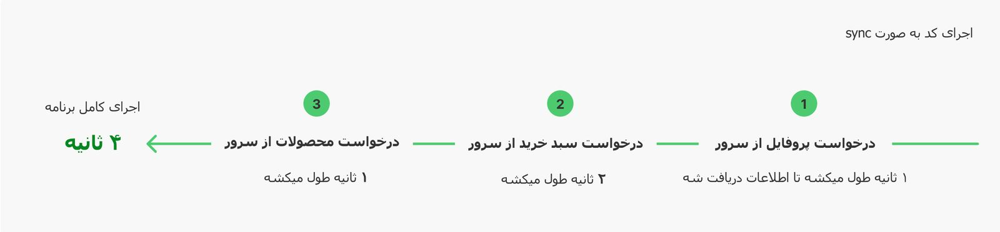
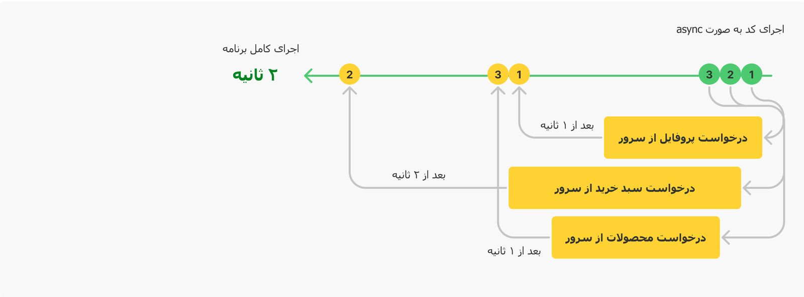
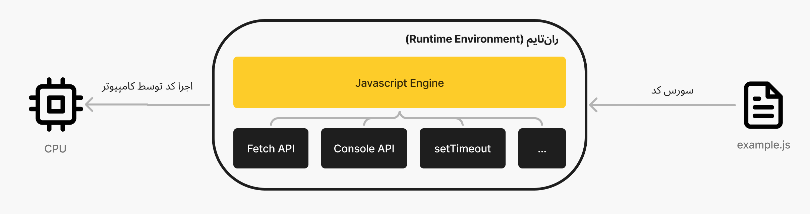

بیشتر از ۲ سال و نیم از آخرین پستی که گذاشتم می‌گذره و قرار نبود انقدر زمان بیفته. مطلبی که اون موقع شروع کرده بودم روش کار کردن، در مورد ویژگی ساسپِنس توی ری‌اکت بود که به تازگی در همون زمان و در [ری‌اکت کانف ۲۰۱۹](https://www.youtube.com/playlist?list=PLPxbbTqCLbGHPxZpw4xj_Wwg8-fdNxJRh) معرفی شده بود. یک پیش‌نویسی ازش نوشته بودم و مراحل نهاییش برای انتشار بود که متاسفانه با اتفاقاتی که توی آبان ۹۸ و اتفاقاتی که بعدش افتاد و همینطور همراهی و هم‌زمانیش با مشکلات شخصی خودم در اون زمان؛ چه از لحاظ اجتماعی و چه از لحاظ شخصی در وضعیت روحی خوبی نبودم. بعد از این بیش از ۲ سال شروع به ریکاوری خودم از اون وضعیت کردم و امیدوارم که رفته رفته با تجربه و قدرت بیشتری بتونم ادامه بدم.

بگذریم و بریم سراغ اصل مطلب.

این مطلب از چهار قسمت کلی تشکیل شده:

- [تعریف sync و async](#what)
- [نحوه‌ی نوشتن کدهای async در جاوااسکریپت](#patterns)
- [کدهای async چجوری اجرا می‌شن](#how)
- [خلاصه](#summary)


## <a id="what">Async و Sync چی هستن؟ تفاوتشون چیه؟</a>

از خود واژه‌ش شروع می‌کنیم چون یک ایده‌ی کلی بهمون میده که داستان چیه.

### تعریف
سینکرونِس (synchronous) به فارسی «هم‌گام» و «هم‌زمان» ترجمه می‌شه و همینطور اِی‌سینکرونِس (asynchronous) توی فارسی بهش «ناهم‌گام» یا «غیر هم‌زمان» میگن. این دو تا واژه رو به صورت کوتاه‌شده بیشتر استفاده می‌کنن، یعنی sync و async. پس از معنیش میشه این حدسو زد که احتمالن چندتا چیز قراره اجرا شن و اینجا بحث سر اینه که گام به گام انجام بشه یا نه. در ادامه مفصل بهش می‌پردازیم.

### خب حالا توی برنامه‌نویسی async و sync به چی میگن و به چه دردی می‌خوره؟

سینک و اِی‌سینک در واقع یک **مدل اجرای** (execution model) کد هستش. مختص به جاوااسکریپت هم نیست و یک مفهوم (concept) هستش که در زبون‌های دیگه‌ی برنامه‌نویسی هم می‌تونید ببینید. (البته توجه داشته باشید که در هر زبانی پیاده‌سازیشون ممکنه تفاوت‌هایی داشته باشن)

توی مدل sync اجرای برنامه و کارها به ترتیب صورت می‌گیره و هر چقدر هم که طول بکشه تا کار فعلی به صورت کامل تموم نشده باشه، سراغ کار بعدی و ادامه‌ی برنامه نمی‌ره. به این شیوه‌ی اجرا blocking هم میگن چون اگه یک جایی از برنامه طول بکشه، برنامه منتظر میمونه که اون تیکه‌ی کد اجرا بشه و اصطلاحن **روند (flow)** اجرای برنامه رو تا اجرای کامل اون تیکه کد بلاک یا متوقف می‌کنه.

در مدل اجرای کد به صورت async ، میشه یک جاهایی از برنامه رو **خارج از روند (flow)** عادی اجرا کرد و برنامه بدون اینکه منتظر اتمام اون کار باشه، بره بقیه‌ی برنامه رو اجرا کنه و اون کاری که از روند خارج شده بود، هر موقع نتیجه‌ش مشخص شد بیاد به برنامه‌‌مون اطلاع بده.

### مثال

فرض کنید که ما یک سبد خرید توی وب‌سایتمون داریم که نیاز داریم اطلاعات پروفایل مشتری، سبد خرید و همینطور محصولات رو از سرور دریافت کنیم تا بتونیم صفحه‌ی سبد خرید رو به کاربر نشون بدیم. پس اینجا ما نیاز داریم تا سه تا درخواست (request) به سرور بفرستیم تا اطلاعاتی که میخوایم رو دریافت کنیم.

ترتیب اجراشون در مدل sync به این صورت میشه: 
در هر مرحله برنامه منتظر اتمام کار می‌‌مونه و بعد میره به مرحله‌ی بعد.



اما در مدل async کارها (درخواست‌هایی که به سرور می‌خواستیم بفرستیم) از روند عادی برنامه خارج میشه و هر کاری که انجام شد به برنامه اطلاع می‌ده:



پس اینجا ما در مدل async ، هم به شکل بهینه‌تری عمل می‌کنیم و هم در زمان کمتری کل کارها رو انجام می‌دیم.

### تبریک! async رو یاد گرفتیم.

همین. کل داستان async همینه.
اگه احیانن در مورد این موضوع سرچ کرده باشید قبلن و خونده باشید، یک عالمه چیز دیگه میان میگن و انقدر بمباران اطلاعات میشه آدم، اصل مطلب اون شکلی که باید جا بیفته جا نمیفته.
مثلن در مورد `event loop` و queue‌های مختلف مثل `callback queue` ، `microtask` و … میان توضیح میدن در صورتی که اینا مستقیمن ربطی به بحث async ندارن. در واقع یک سری ابزار و یک نوعی از پیاده‌سازی هستن که این رفتاری که شما توی مرورگر یا نود جی‌اس می‌بینید، رو می‌سازن. جلوتر بیشتر توضیح میدم که داستان چیه.

### جمع‌بندی این بخش

کدهایی که می‌نویسیم در واقع یک سری دستورات هستش که ما تعریف می‌کنیم و کامپیوتر موظفه که به ترتیب اجراشون کنه.
همونطور که دیدیم روند برنامه (program flow) در واقع نحوه‌ی اجرای کدها هستش. حالت پیشفرض اینه که به ترتیب برنامه رو اجرا کنه و نمیتونیم بدون اجرای کامل کار هر مرحله، به مرحله‌ی بعد بریم؛ حتی اگه انجام اون مرحله و کار زمان زیادی طول بکشه. به این حالت میگیم **حالت synchronous**.

**حالت asynchronous** این شکلی بود که یک جاهایی از برنامه رو میشه مشخص کرد که از روندِ اجرایِ عادیِ برنامه خارج بشه و به برنامه اجازه بدیم که بره دستورات بعدی رو اجرا کنه. به این کار اصطلاحن آف‌لود کردن کار (offload) هم میگن.

حالا که فهمیدیم async چی هستش. یکم میریم جلوتر و می‌بینیم که توی جاوااسکریپت کدهای async به چه شکل نوشته می‌شن.

## <a id="patterns">نحوه‌ی نوشتن و استفاده از Async در جاوااسکریپت</a>

توی جاوااسکریپت معمولن به سه شکل کدهای async رو می‌نویسیم. 

### نوشتن به صورت callback

نمونه در مرورگر:

```js
// Browser
setTimeout(function folan(){
  console.log("hello");
}, 100);
```

نمونه در node js:

```js
import * as fs from "fs";

fs.readFile("test.txt", function folan(err, data){
    // ...
});
```

### نوشتن به صورت promise

نمونه در مرورگر:

```js
fetch("https://folan.com").then(function(response){
  // ...
})
```

نمونه در نود جی‌اس:

```js
import * as fs from "fs/promises";
fs.readFile("test.txt").then(function(err, data){
    // ...
});
```

### نوشتن به صورت async/await

این مدل در واقع همون پرامیسه که سینتکس بهتر و خوانایی داره. بهش اصطلاحن میگن `sugar syntax` یا سینتکسِ شِکری :دی

نمونه در مرورگر:

```js
async function get_data(){
  let response = await fetch("https://folan.com");
  // Rest of code ...
}

get_data();
```

نمونه در نود جی‌اس:

```js
import * as fs from "fs/promises";

async function read_test_file(){
  let data = await fs.readFile("test.txt");
  // Rest of code ...
}

read_test_file();
```


**نکته مهم:** 
من برای اینکه می‌خوام موضوع روی async متمرکز بمونه وارد جزییات `Promise` و `async/await` نشدم و صرفن نمونه‌هایی ازشون رو استفاده کردم. 

توصیه می‌کنم اگه دنبال منبع فارسی می‌گردید می‌تونید از خلاصه‌ای که توی بخش دوم از [«سوالات مصاحبه جاوااسکریپت در خارج از ایران»](https://01.mojtabast.com/frontend-interview-questions-javascript-part-2#async) نوشتم استفاده کنید.

اگه منبع انگلیسی می‌خواید برای [پرامیس](https://exploringjs.com/impatient-js/ch_promises.html) و [async/await](https://exploringjs.com/impatient-js/ch_async-functions.html) از کتاب JavaScript for impatient programmers رو توصیه می‌کنم. همینطور از MDN [این راهنما](https://developer.mozilla.org/en-US/docs/Learn/JavaScript/Asynchronous/Promises) رو پیشنهاد می‌کنم و [این منبع](https://javascript.info/async) رو از سایت javascript.info.

## <a id="how">کدهای Async چجوری در جاوااسکریپت اجرا میشه؟</a>

قبل از اینکه بخوایم ببینیم که کدهای Async چجوری اجرا میشه، یک مرور اجمالی داشته باشیم که کدهای خودِ جی‌اس چجوری اجرا میشه.

**نکته برای کسایی که تازه برنامه‌نویسی رو شروع کردن:‌** این قسمت از توضیحات مباحث عمیق‌تری هستش از نحوه‌ی اجرای کدهای جاوااسکریپت روی کامپیوتر، اگه تازه برنامه‌نویسی رو شروع کردید و هنوز توش راحت نیستید، مطالب این قسمت براتون مناسب نیست و می‌تونید در آینده بهش مراجعه کنید. 

### ران‌تایم و انجین جاوااسکریپت

یک چیزی که ممکنه گیج کننده باشه اینه که آیا این دو تا یکین؟ یا اینکه تفاوت دارن با هم؟ داستانشون چیه؟ جواب کوتاه اینه که بله فرق دارن.

موتور یا انجین (Engine) جاوااسکریپت در واقع وظیفه‌ش اینه که سورس کد رو بگیره و [طبق استاندارد جاوااسکریپت](https://tc39.es/ecma262/) تبدیلش کنه به کد قابل اجرای ماشین تا روی CPU اجرا شه. خلاصش این میشه که کد جی‌اس (سورس کد) رو میگیره و اجراش میکنه.

ران‌تایم (runtime environment) جاوااسکریپت توی خودش از یک انجین استفاده می‌کنه که بتونه کدهای جاوااسکریپت رو اجرا کنه و همینطور در کنارش موقع اجرای کد از یک سری ابزار و کتابخونه (library) استفاده می‌کنه (که یک سریاش رو API میده و میشه توی کد ازش استفاده کرد).




**نکته‌:** توجه داشته باشید که من در ادامه هرجا که می‌گم ران‌تایم منظورم همین `runtime environment` هستش.

چندتا مثال از انجین‌ها و ران‌تایم‌ها بزنیم.

چندتا از Engine معروف جاوااسکریپت اینا هستن: [V8](https://v8.dev/) که توی کروم و nodejs استفاده میشه. [SpiderMonkey](https://spidermonkey.dev/) که توی فایرفاکس استفاده می‌شه. [JavaScriptCore](https://developer.apple.com/documentation/javascriptcore) که توی سافاری استفاده میشه.
همینطور [Garbage collection](https://en.wikipedia.org/wiki/Garbage_collection_(computer_science)) که برای مدیریت حافظه (memory) استفاده میشه و یا [Just-in-time compilation](https://en.wikipedia.org/wiki/Just-in-time_compilation) که برای کامپایل کردن کد موقع اجرا استفاده میشه رو شاید شنیده باشید؛ اینا هم توی انجین پیاده‌سازی شدن.

محیط‌های مختلفی مثل مرورگر و یا سیستم هستن که میشه با استفاده از ران‌تایم‌های پیاده‌سازی شده، کدهای جاوااسکریپت رو اجرا کنن. معروف‌ترین‌هاش مرورگر کروم/فایرفاکس و همینطور نود جی‌اس که روی سیستم کدهای جاوااسکریپت رو اجرا میکنه. من اینجا قصدم این نیست که تفاوت این ران‌تایم‌های رو بررسی کنم؛ چون هم زیادن و هم یک سری اصطلاحات و مفاهیم دیگه میارن وسط که خارج از بحثمون هستش.

اما در عوض یک سری از ابزار و کتابخونه رو که این ران‌تایم‌ها برای اجرای کد استفاده می‌‌کنن رو معرفی می‌کنم چون اینجا هدف آشنایی با این قسمت‌ها هستش و اینکه یک ایده‌ی کلی بگیریم.

من این ابزارها و کتابخونه‌‌ها رو به دو قسمت تقسیم می‌کنم. اون‌هایی که به صورت داخلی (internal) توی ران‌تایم داره استفاده میشه (مثلن مرورگر) و اونایی که ما ازشون مستقیمن می‌تونیم در کد جاوااسکریپتی‌مون استفاده کنیم.

یکی از ابزاری که به صورت داخلی استفاده می‌‌کنن event loop هستش (اگه آشنا نیستید [اینجا توضیح دادم](https://01.mojtabast.com/frontend-interview-questions-javascript-part-2#event-loop) بیشتر، امیدوارم که کمک کنه). کروم برای event loopـش از یک کتابخانه به اسم [libevent](https://libevent.org/) و nodejs هم از [libuv](http://docs.libuv.org/en/v1.x/) استفاده می‌ کنه.

از چیزهایی که در در ران‌تایم پیاده‌سازی شده و به جاوااسکریپت API داده شده، میشه از [Fetch](https://developer.mozilla.org/en-US/docs/Web/API/Fetch_API) نام برد که ران‌تایم‌های مختلف مطابق این [استاندارد و مشخصات (spec)](https://fetch.spec.whatwg.org/) پیاده سازیش کردن.

نمونه کد:

```js
fetch('http://example.com/movies.json')
      .then(response => response.json())
      .then(data => console.log(data));
```

اینجا در واقع ما داریم از API فِچ استفاده می‌کنیم که توسط ران‌تایم پیاده سازی شده و اون API فچ خروجیش یک Promise جاوااسکریپتی هستش که باهاش نتیجه رو به ما اعلام می‌کنه.

حالا اگه بخوایم بررسی کنیم این API توی چه ران‌تایم‌هایی پیاده‌سازی شده، من چند نمونه‌ش رو می‌گم:

**مرورگر**: توی مرورگر از مدت‌ها پیش پیاده سازی شده (این [پیاده‌‌سازی WebKit هستش](https://github.com/WebKit/WebKit/tree/main/Source/WebCore/Modules/fetch) مثلن)

**نود جی‌‌اس**: توی Node.js در [ورژن ۱۷.۵](https://nodejs.org/en/blog/release/v17.5.0/) به صورت تجربی (experimental) اضافه شده که میشه فعالش کرد.

**دنو**: توی [deno](https://deno.land/manual/examples/fetch_data) (اگه آشنا نیستید؛ مشابه nodejs هست) این قابلیت پیاده‌سازی شده و میشه ازش استفاده کرد.

به جز Fetch ، لیست کامل APIهایی که توی محیط مرورگر (وب) قابل دسترسه و میشه ازش توی جاوااسکریپت استفاده کرد از [این صفحه](https://developer.mozilla.org/en-US/docs/Web/API) قابل مشاهدس. لیست API‌‌های Node.js هم [از اینجا میشه دید](https://nodejs.org/docs/latest/api/).

خب مهمترین چیزی که اینجا فهمیدیم اینه که بر خلاف تصور اولیه خیلی چیزا مستقیمن برای خود زبون جاوااسکریپت نیستش و توسط ران‌تایم، به صورت API به جاوااسکریپت داده می‌شه.
من خودم اولین باری که فهمیدم setTimeout متعلق به خود زبان جاواسکریپت نیستش، دچار شوک بزرگی شدم :))) ([این spec جاوااسکریپت](https://tc39.es/ecma262/) هستش، سرچ کنید می‌بینید که نیست)

### کدهای Async چجوری اجرا میشن؟

تا اینجا فهمیدیم که جاوااسکریپت یک سری پترن داره برای نوشتن کدهای async و همینطور کدهای جاوااسکریپت چجوری دارن اجرا میشن. پرسش بعدی اینه که کدهایی که به صورت async نوشته می‌شن و از روند عادی برنامه خارج میشن چه اتفاقی براشون میفته؟

روال کلی اینطوریه که کدهای async موقع اجرا به واسطه انجین از روند عادی برنامه خارج می‌شن و اون API مربوطه که توی ران‌تایم هستش وظیفه داره که اون کار رو انجام بده و نتیجه رو به جاوااسکریپت اطلاع بده. اینطوری فرض کنید که خارج از جاوااسکریپت یک چیزی باید مسئول اجرا کردن کار باشه و بعد از انجام دادنش بیاد بگه که نتیجه‌ش چی بوده. موفقیت آمیز بوده؟ نبوده؟

انجین جاوااسکریپت و ران‌تایم برای اینکه بتونن همچین ارتباطی رو مدیریت کنن، باید یک ساز و کاری باشه که وقتی یک کاری رو از روند عادی برنامه خارج می‌کنیم، ران‌تایم بتونه هر وقت که کارو انجام داد به جاوااسکریپت اطلاع یا سیگنال بده. علاوه بر اینا وقتی تعداد این کارها (async) زیاد شد جاوااسکریپت باید بتونه به درستی سیگنالی که دریافت می‌کنه رو پردازش کنه و کاری که براش مشخص شده رو انجام بده. این ساز و کار چیه؟ یک تعدادی صف (queue) که توسط یک چیزی به اسم event loop مدام در حال اجرا شدنه و وظیفش اینه که این سیگنال‌هایی که دریافت می‌کنه رو به ترتیب پردازش کنه.

آیا فقط یک صف برای event loop وجود داره؟ نه. هر ران‌تایمی، صف‌های مختص به خودش رو داره. یعنی مرورگر صف‌هایی که داره با صف‌هایی که توی نود جی‌اس هستش مشابه نیست. (مشترک دارن ولی صف‌های متفاوت از هم دارن) 

برای اینکه مطلب جا بیفته من چندتاشو اینجا اشاره می‌کنم.

طبق [استانداردی که برای ایونت‌لوپ توی وب](https://html.spec.whatwg.org/multipage/webappapis.html#event-loops) هستش، ران‌تایم دو تا صف‌ داره به اسم `task queue` و `microtask queue` . تفاوتشون اینه که اجرای مایکروتسک‌ها اولویت بالاتری دارن نسبت به تسک کیو. اینطوری که بعد از اجرای هر کاری از تسک کیو، ایونت لوپ اولین کاری که می‌کنه اینه که میره صف مایکروتسک‌ها رو اجرا می‌کنه و بعد دوباره میره سراغ تسک کیوها.
نمونه‌ش `setTimeout` هستش که میره توی صف `task queue` و همینطور پرامیس‌ها که میرن توی صف `microtask queue` .

نکته‌ی آخرمم اینه که به این صف‌ها بعضی وقتا اسمای دیگه هم میگن از جمله به تسک کیو که `callback queue` هم می‌گن. در نظر داشته باشید که تفاوتی ندارن. همینطور ران‌تایم ممکنه صف‌های دیگه هم داشته باشه و یا حتی جزییات پیاده‌سازی‌شون با صف‌هایی که توی استاندارد وب پیشنهاد شده تفاوت‌هایی داشته باشن، اما خب چیزی که برای ما مهمه اینه که کلیت داستان همینه.

توی ران‌تایم Node.js صف‌هاش متفاوته و صف‌های بیشتری داره نسبت به وب. جزییاتش خارج از بحث این مطلبه ولی اگه علاقه‌مند هستید که ایونت لوپ توی نود جی اس چه شکلی کار می‌کنه می‌تونید از [این راهنمای خودشون](https://nodejs.org/en/docs/guides/event-loop-timers-and-nexttick/) مطالعه کنید.

## <a id="summary">جمع‌بندی و خلاصه</a>

- در برنامه نویسی، async یک مفهوم هستش که جاوااسکریپت هم اونو در خودش داره.
- به طور خلاصه خارج کردن یک کار از روند عادی اجرای برنامه رو async می‌گن.
- سه الگو برای نوشتن کدهای async در جاوااسکریپت وجود داره: کال‌بک (callback)، پرامیس (Promise) و async/await
- انجین جاوااسکریپت (از جمله V8) وظیفه‌ش اجرای کد جاوااسکریپت هستش و ران‌تایم قابلیت‌های بیشتری رو به صورت API موقع اجرای کد به جاوااسکریپت میده از جمله fetch
- کدهای async که از روند عادی برنامه خارج میشن، معمولن در محیط، یک ماژول توی ران‌تایم وظیفه‌ی اجراش رو بر عهده می‌گیره و بعد از اجراش به جاوااسکریپت نتیجه رو اعلام می‌کنه. نتیجه توی یک صف قرار میگیره و ایونت لوپ وظیفش اینه که این صف‌ها رو مدام چک کنه و روی هر نتیجه کال‌بک‌هایی که توی کد مشخص شده رو اجرا کنه.
- صف‌های مختلفی وجود که تفاوتشون توی اولویت اجرا و اینکه در چه زمانی اجرا شن هستش عمدتن. صف‌هایی از جمله `task queue` و `microtask queue`

ممنون که این مطلب رو خوندید، امیدوارم که فرصت کنم بیشتر و منظم‌تر بنویسیم. اگه فکر می‌کنید که این مطلب بدرد دوستانتون هم می‌خوره خوشحال میشم که برای اونا هم بفرستید.

### منابع بیشتر

اگه جزییات چگونگی کار کردن هر قسمت رو می‌خواید بهترین گزینه استاندارد خود اون ویژگی و یا زبان هستش. توی متن لینک‌ها رو قرار دادم ولی مهم‌ترین‌هاش رو اینجا باز لیست می‌کنم:

- [استاندارد جاوااسکریپت](https://tc39.es/ecma262/)
- [استاندارد ایونت لوپ برای وب](https://html.spec.whatwg.org/multipage/webappapis.html#event-loops)
- [استاندارد fetch](https://fetch.spec.whatwg.org/)

مطالب مرتبط با بحث async:

- [تفاوت Asynchronous, Synchronous, Concurrency, Parallelism, Thread and process](https://www.youtube.com/watch?v=gTGmpj_pyP4) (فارسی)
- [Introducing asynchronous JavaScript](https://developer.mozilla.org/en-US/docs/Learn/JavaScript/Asynchronous/Introducing)
- [Asynchronous Programming](https://eloquentjavascript.net/11_async.html)
- [Understanding Asynchronous JavaScript](https://blog.bitsrc.io/understanding-asynchronous-javascript-the-event-loop-74cd408419ff)
- [Futures and promises](https://en.wikipedia.org/wiki/Futures_and_promises)

مطالب مرتبط با ایونت لوپ:

- [مستندات libuv](http://docs.libuv.org/en/v1.x/api.html)
- [کتاب راهنمای libevent](http://www.wangafu.net/~nickm/libevent-book/)
- [مقایسه‌ی کتابخانه‌های مختلف از جمله libevent, libev, libuv](https://blog.actorsfit.com/a?ID=00650-08d96b49-8357-4c7b-894d-68ed6fca7eb0)
