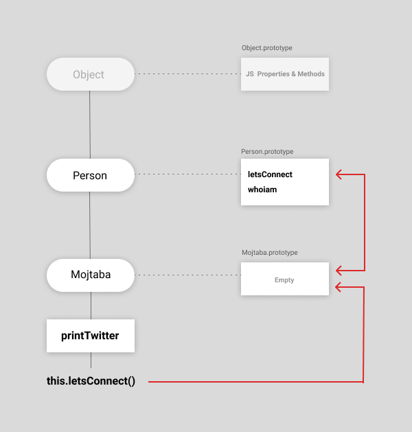
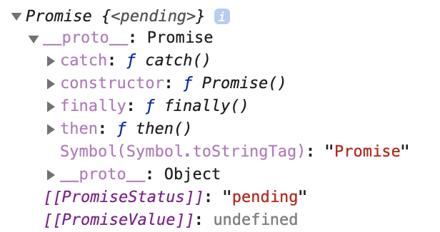
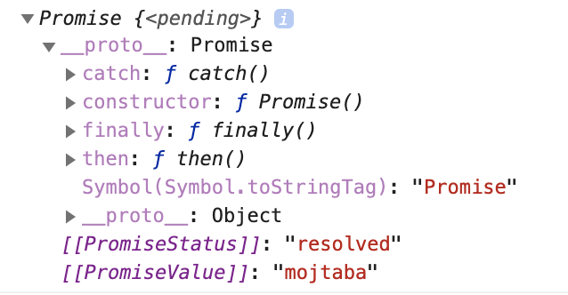
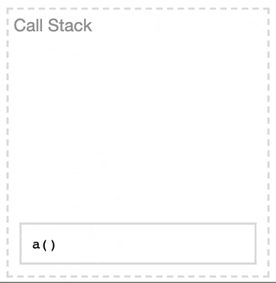
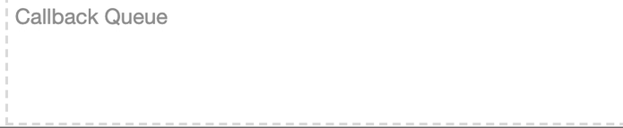

توی [بخش اول](/frontend-interview-questions-javascript) ۵ تا مبحثی که شما از جاوااسکریپت باید بدونید رو در موردشون صحبت کردیم. این مباحث شامل موارد زیر می‌شدن:

- [Scope](frontend-interview-questions-javascript#scope)
- [this & binding](frontend-interview-questions-javascript#this-binding)
- [Closure](frontend-interview-questions-javascript#closure)
- [ماژول‌ها در جاوااسکریپت](frontend-interview-questions-javascript#modules)
- [آشنایی با ES6](frontend-interview-questions-javascript#es6)

توی این پست قراره در مورد ۵ تا مبحث دیگه که شامل موارد زیر میشن صحبت کنیم:

- [Prototypes](#prototypes)
- [Async](#async)
- [Event Loop & Call Stack](#event-loop)
- [Types](#types)
- [Coercion](#coercion)


# <a id="prototypes">Prototype</a>

احتمالن خیلی شنیدید که میگن جاوااسکریپت آبجکت‌اورینتد یا فانکشنال نیست به صورت کامل ( از هر دو به نوعی پشتیبانی میکنه البته) ، خب پس چیه؟ جاوااسکریپت از یه مفهمومی به اسم prototype استفاده میکنه. این یکی از ویژگی‌هاش هست که برنامه‌نویسایی که زبون‌های دیگه  کار کردن سرش به چالش میفتن. خب بریم سر اصل داستان.

هر آبجکتی که شما درست می‌کنید یک آبجکتی به اسم prototype داخلش داره. حالا این prototype چی هستش؟

برای اینکه مفهوم رو بتونم درست‌تر توضیح بدم میخوام از مفهوم کلاس توی زبون‌هایی مثل جاوا و یا سی پلاس پلاس استفاده کنم. توی این زبون‌ها شما وقتی یک کلاسی رو تعریف می‌کنید و میخواید از اون استفاده کنید اصطلاحن یک instance (نمونه؟) میگیرید. اتفاقی که میفته اینه که اون اینستنس تمام اون خصوصیت کلاس رو **کپی میکنه.**

[کایلی سیمپسون](https://github.com/getify) یه مثال قشنگی میزنه در این باره که منم از همون استفاده می‌کنم. یک آدمی وقتی بچه‌دار میشه یک کپی از دی‌ان‌ای اون ادم به بچش منتقل میشه و یک سری خصوصیاتش رو میگیره. بعد از اینکه بچه متولد میشه وقتی مثلن باباش دستش میشکنه آیا دست بچش هم میشکنه؟ مسلمن نه. کلاس‌ها هم به همین صورت هستن موقعی که اینستنس میگیرید در واقع یک بار از اون کلاس خصوصیاتش کپی میشه و اگه تغییراتی توی اینستنس به وجود بیارید فقط مختص به همون اینستنس هستش و اون کلاس اصلی تغییری توش ایجاد نمیشه. یعنی شما ۱۰ تا اینستنس هم بگیرید ازش هیچ کدوم از اون اینستنس ها باعث نمیشن که اون خصوصیت اصلی که توی تعریف کلاس هست تغییر کنه.

خب از این استفاده کردم که بگم که **جاوااسکریپت اینطوری نیست**. توی جاوااسکریپت وقتی شما اینستنس میگیری در واقع اتفاقی که میفته اینه که یک live link به prototype دارید. یعنی کپی نمیشه و شما لینک هستید به prototype.


```js

// این فانکشن رو به عنوان پایه در نظر بگیرید.
function Person(name, twitter) {
  this.name = name;
  this.twitter = twitter;
}

// این جا به پروتوتایپش دو تا متد اضافه داریم می‌کنیم.
Person.prototype.letsConnect = function() {
  return this.twitter;
};

Person.prototype.whoiam = function() {
  return this.name;
};

// اینجا دو تا اینستنس از فانکشن پایمون گرفتم.
let Mojtaba = new Person("Mojtaba Espari Pour", "mojtabast_fa");
let Houshang = new Person("Houshang Ebtehaj", "test");

// اینجا یک متدی رو به اینستنس مجتبی اضافه کردم که توش داره
// یک متدی رو هم صدا میزنه.
Mojtaba.printTwitter = function() {
  console.log("My twitter account is https://twitter.com/" + this.letsConnect());
};

// خروجی خط پایین به این صورت میشه:
// My twitter account is https://twitter.com/mojtabast_fa
Mojtaba.printTwitter();

```

به صورت تصویری بخوام نشون بدم همچین چیزی میشه:



همونطور که میبینید وقتی توی `printTwitter` داریم `this.letsConnect` رو صدا میزنیم، جاوااسکریپ اول توی متدای خود اینستنس `Mojtaba` میگرده و بعد توی پروتوتایبپش میگرده که می‌بینه بازم نیست و حالا شروع می‌کنه که توی پروتوتایپ‌های بالاترش پیدا کنه متد رو. به این صورت که یک لول بالاترش میشه پروتوتایپ `Person` و توی اون متد `letsConnect` رو همونطور که می‌بینیم داره. به این مکانیزم میگن **prototype chain** اصطلاحن که همونطور از اسمش پیداس در واقع پروتوتایپ هم مثل زنجیر به هم وصلن و اگه چیزی توی یکی از این حلقه‌های زنجیر پیدا نشه میره به حلقه‌ی بعدی تا زمانی که بتونه پیداش کنه.

# <a id="async">Async</a>

asynchronous چی هست؟ همونطور که می‌دونید جاوااسکریپت single thread هستش به این معنی که در لحظه می‌تونه فقط یک کار رو انجام بده. اما گاهی اوقات نیاز هستش یه سری کار ها توی یک زمان خاصی انجام بشه نه در همون لحظه. به عنوان مثال شما یک ریکوئستی به سرور می‌زنید و تا اینکه جواب رو از سرور بگیرید معمولن یک مدتی طول میکشه یا اینکه یک زمانی هست میخواید یک کدی بعد مثلن ۳ ثانیه اجرا بشه خب اینجا جاوااسکریپت باید چیکار کنه؟ thread رو باید بلاک کنه؟ خب جوابش قطعن اینه که نباید بلاک کنه و بقیه کد رو اجرا کنه و هر زمان که زمانش رسید اون کدی که مشخص کردیم رو اجرا کنه.

```js

    function showMeSomething(){

    	console.log("I will be the second one 😬")
    }

    setTimeout(showMeSomething, 3000);

    console.log("I'm the first one 💪🏽")

```

همونطور که گفتیم اینجا جاوااسکریپت سه ثانیه صبر (بلاک) نمیکنه تا فانکشن رو اجرا کنه. بقیه برنامه رو اجرا میکنه و بعد از سه ثانیه اون فانکشنی که ما بهش دادیم رو اجرا میکنه. توی قسمت بعدی توضیح می‌دم که چجوری اینکارو انجام میده و چه ساز و کاری پشت قضیه هست.

async به شیوه‌های زیر هندل میشه توی جاوااسکریپت:

### Callback

توی این حالت معمولن شما یک فانکشن رو به عنوان کالبک ست می‌کنید و اون کالبک صدا زده میشه سر وقتش. چند نمونه که این مدلی کار می‌کنن:

- setTimeout
- XMLHttpRequest
- خوندن/نوشتن فایل توی nodejs
- و ....

### Promise

پرامیس‌ها یک تلاشی توی جاوااسکریپت هستن که این رفتار async رو خواناتر و بهتر هندل کنه. اگه به مثال قبلی توجه بکنید setTimeout برای خود جاوااسکریپت نیستش و در واقع یک Web Browser API هستش که توی قسمت پایین‌تر توضیح میدم که منظور چیه. ولی کلیتش به این صورته که یک سری از فانکشنالیتی‌ها و عملکردها خارج از جاوااسکریپت و از طریق خود مرورگر داره انجام میشه و برای دسترسی بهشون خود مرورگر یک سری API به جاوااسکریپت داره میده که setTimeout هم یکی از همین API ها هستش.

این رو باید بدونید تا تفاوت روش قبلی و پرامیس رو متوجه بشید. توی روش قبلی شما یک کال‌بکی ست می‌کردید و هر وقت موقعش رسید اون کالبک صدا زده میشد.

این مثال رو توجه کنید:

```js
var PromiseMeYouWillReturnMyName = new Promise(function(resolve, reject) {
  setTimeout(function() {
    resolve('mojtaba');
  }, 3000);
});

PromiseMeYouWillReturnMyName.then(function(name){
  console.log(name)
});

console.log(PromiseMeYouWillReturnMyName);
```

پرامیس اینطوری نوشته میشه. حالا به کنسول لاگ که توی آخرین خط هستش دقت کنید. همونطور که گفتم جاوااسکریپت سینگل ترد هستش و منتظر نمی‌مونه که یک کدی بعد یک مدتی مثلن اجرا شه و بعد بره سراغ بقیه برنامه. جاوااسکریپت وقتی میخواد پرامیس رو اجرا میکنه، پرامیس یک آبجکت به شکل زیر برمیگردونه همون لحظه. اگه آخرش رو دقت کنیم می‌بینیم که Value خالی هستش.



بعد از اینکه پرامیس کارش تموم شد، اصطلاحن resolve میشه. به این معنی که مثلن شما یک ریکوئستی زدید به سرور٬ بعد که جواب رو گرفته در واقع کارش رو انجام داده و حالا پرامیس رو resolve میکنه که مشخص بشه کار پرامیس تمومه و مقداری که باید میگرفته رو گرفته.

توی کد بالا بعد از سه ثانیه پرامیس resolve میشه که به این معنیه که پرامیس کارش رو انجام داده. بعد اینکه resolve شد همین آبجکت روه آپدیت میکنه و به شکل زیر میشه:



خب همونطور که می‌بینید آبجکت رو با مقادیر جدید آپدیت کرد. حالا یک سری متد داره که به شما این امکان رو میده که بدونید که کی پرامیس resolve میشه و یا کی به مشکل می‌خوره. این متد‌ها رو توی پروتوتایپش دارید می‌بینید که شامل `then` و `catch` و باقی متد‌ها میشه.

یکی دیگه از مواردی که توی پرامیس مطرحه خصوصیت زنجیره‌ای بودنش هست. یعنی شما با استفاده از `then` و `catch` پشت سر هم می‌تونیم برای پرامیس توی حالتای مختلف کالبک بذارید.

برای نمونه fetch API که اخیرن به جاوااسکریپت برای کار با شبکه و ریسورس اضافه شده پرامیس هستش.

```js
fetch("http://mojtabast.com/blahblah").then( ... )
```

### Async/Await

توی جاوااسکریپت ۲۰۱۷ اومدن پرامیس‌ها رو راحت تر بکنن و نتیجش شد async function‌ها. با استفاده از این فانکشن شما قابلیت استفاده از یک کلمه کلیدی به `await` رو هم دارید که با ترکیب این دوتا همون کاری که با پرامیس‌ها می‌تونید بکنید رو با این ها هم میتونید به مراتب خواناتر و راحت تر انجام بدید. یه مثال ساده میخوام بزنم با استفاده از مثال قبلی. به این صورت که بعد سه ثانیه نام رو پرینت کنه و سه ثانیه بعدش هم نام خانوادگی.

```js

// اینجا دو تا فانکشن داریم که دو تا پرامیس رو برمیگردونن.
function name(your_name) {
  return new Promise(function(resolve) {
    setTimeout(function() {
      console.log(your_name);
      resolve("espari pour");
    }, 3000);
  });
}

function lastname(your_lastname) {
  return new Promise(function(resolve) {
    setTimeout(function() {
      console.log(your_lastname);
      resolve(your_lastname);
    }, 3000);
  });
}

// اگه بخوایم از پرامیس استفاده کنیم.
function promise_NameAndLastName() {
  new Promise(function(resolve) {
    console.log("my name is");

    resolve("mojtaba");
  })
    .then(function(my_name) {
          return name(my_name);
    })
    .then(function(my_lastname) {
      return lastname(my_lastname);
    });
}

promise_NameAndLastName();

// استفاده از async func

async function async_NameAndLastName(){

  console.log("my name is");

  var my_lastname = await name("mojtaba");

  await lastname(my_lastname);
}

async_NameAndLastName();
```

مثال‌ها و توضیحات بیشتر رو می‌تونید از [MDN](https://developer.mozilla.org/en-US/docs/Learn/JavaScript/Asynchronous/Async_await) بخونید.

`async/await` به نسبت پرامیس‌ها کمتر قابلیت کنترل ارور رو دارن. به این معنی نیست که ندارن ولی به نسبت پرامیس‌ها محدودتر هستن.

یکمی هم اگه بخوایم در مورد `await` صحبت کنیم باید بگم که به این شکل هستن:

```js
output = await expression;
```

`expression` هم میتونه هر مقداری باشه و هم میتونه یک پرامیس باشه که اگه پرامیس باشه فانکشن صبر میکنه تا resolve بشه و هر وقت ریسالو شد مقداری که به عنوان خروجی بر میگیرده رو میتونید اساین کنید به `output`. نمونش رو توی مثال بالا توی خط `var my_lastname = ... ` میتونید ببینید.

# <a id="event-loop">Event Loop & Call Stack</a>

خب بریم سراغ بحث شیرین ایونت لوپ و رفقا. توی این قسمت سعی میکنم اینارو توضیح بدم:

- Web Browser API
- Call Stack
- Callback Queue
- Event Loop

### Web Browser API
خب اولین چیزی که ممکنه شگفت‌زدتون بکنه اینه که یک سری از چیزایی که توی جاوااسکریپت استفاده می‌کردید در واقع متعلق به خود جاوااسکریپت نیست و شما از یک API به خصوصی که مرورگر بهتون داده دارید استفاده می‌کنید. همونطور که قبل‌تر اشاره کردم از `setTimeout` ، `fetch` به عنوان نمونه می‌تونم نام ببرم. APIهای بیشتری وجود داره مثل `DOM`، `SVG`، `Storage` و ... که می‌تونید [لیست کاملش رو از اینجا ببینید](https://developer.mozilla.org/en-US/docs/Web/API).

پس مرورگر به ما توی جاوااسکریپت یک سری قابلیت‌های بیشتری رو داره ارائه میده که ما می‌تونیم ازش استفاده کنیم.
 یک نکته‌ای رو همینجا بگم. مرورگر در واقع یک **محیط** هستش برای اجرا شدن جاوااسکریپت. یکی دیگه از معروف‌ترین محیط‌هاش `nodejs` هستش که توی اون محیط هم شما به APIهای مختص به خودش دسترسی دارید.

### Call Stack

فکر می‌کنم اسمش رو معنی کنیم به خوبی می‌تونه بیانگر کاری که می‌کنه باشه. خب اگر با Stack آشنا نیستید، استک یک دیتااستراکچر هستش که این مفهوم رو ارائه می‌ده که **آخرین چیزی که به لیست اضافه میشه، اولین چیزیه که ازش خارج میشه**. یک توضیح قشنگ‌ترش رو من از مستندات زبون Rust نقل میکنم. استک رو مثل بشقاب‌ها در نظر بگیرید. وقتی می‌خواید یک بشقاب اضافه کنید، بشقاب رو میذارید روی قبلیا و وقتی هم که یکیش رو نیاز داشته باشید که بردارید آخری (روییه در واقع) رو بر می‌دارید. از یه همچین دیتااستراکچری جاوااسکریپت استفاده می‌کنه که بتونه Callها رو track (رهگیری؟) کنه.
خب منظور از کال چیه؟ کد پایین رو نگاه کنید:

```js

function c(){

  console.log("hello");
}

function b(){

  c();
}

function a(){

  b();
}


a();

```

فکر می‌کنم با این منظور برسه:



به این شکل جاوااسکریپت کدهای شما رو اجرا می‌کنه.

### Callback Queue

خب Async چجوری توی مرورگر و جاوااسکریپت هندل می‌شه؟ برای نمونه وقتی ما یه همچین کدی داریم:

```js

setTimeout(function(){
  //...
}, 3000);

```

مرورگر بعد سه ثانیه چجوری اون کالبک رو از جاوااسکریپت درخواست می‌کنه که اجرا بکنه؟ خب اینجا باز یه چیزی هستش به اسم Callback Queue که وظیفش اینه که یه صفی رو درست بکنه و هر وقت جاوااسکریپت سرش خلوت شد مرورگر بتونه این صف رو هدایت کنه به جاوااسکریپت تا اجراش کنه. Queue هم یک دیتااستراکچر هستش مثل استک با این تفاوت که **اولین چیزی که به لیست اضافه میشه، اولین چیزی هم هستش که از لیست خارج میشه**.

کد زیر رو نگاه کنید:

```js

setTimeout(function hello(){ console.log("hello"); }, 2000);
setTimeout(function world(){ console.log("world"); }, 3000);

```

به این شکل Queue میشه:



### Event Loop

خب وقتی یک چیزی Queue میشه چجوری مرورگر میفهمه که چیا توی کیو هست و اگر چیزی هست بدش به جاوااسکریپت اجراش کنه؟ خب این وسط یه مکانیزمی داره به اسم ایونت لوپ. ایونت لوپ مثل یه حلقه بی‌نهایت می‌مونه که هی اجرا می‌شه و وظیفش اینکه هی کیو رو چک کنه و اگر چیزی توش بود به جاوااسکریپت بگه که اجراش کنه.

یک سوال خیلی معروف هستش که قبلن هر مصاحبه‌ای میرفتی میپرسیدن. 😂 با توجه با این توضیحات این قسمت الان راحت میشه جوابش داد. کد زیر رو نشون میدادن:

```js

setTimeout(function(){
  console.log("yoohoo");
}, 0)

console.log("boom");
```

و میپرسیدن که کدوم اول توی کنسول نشون داده میشه؟ اگه همینطوری نگاه بکنیم میگیم خب یوهو اول اجرا میشه چون ۰ هستش ولی خب در واقع اول بوم چاپ میشه و بعد یوهو نمایش داده میشه. دلیلش چیه؟ جاوااسکریپت که میخواد کد رو اجرا کنه از مرورگر درخواست میکنه که یوهو رو بعد از ۰ میلی ثانیه نمایش بده. ولی چون اینجا داره از API استفاده میکنه میره توی پروسه همین ایونت لوپ و رفقا. به خاطر همین بلافاصله مرورگر کد رو اجرا میکنه ولی باید بذارتش توی صف یا همون Callback queue و هر وقت جاواسکریپت باقی کدارو اجرا کرد بعد شروع میکنه چیزایی که توی کیو هستن رو اجرا میکنه. به همین دلیله که بوم اول نمایش داده میشه چون جاوااسکریپت صبر نمیکنه که اون `setTimeout` اجرا بشه بعد بره باقی کدهارو اجرا کنه. از مرورگر درخواست میکنه که اون کارو انجام بده و هر وقت مرورگر انجام داد قرارش میده توی صف که جاوااسکریپت لطف بکنه و به callback queue یه سری بزنه هر وقت کار خودشو تموم کرده بود.

خب فکر میکنم چیزایی که توی این تاپیک میخواستم مطرح کنم رو کردم و در پایان توصیه میکنم [این ویدیو رو از فیلیپ رابرتس ببینید](https://www.youtube.com/watch?v=8aGhZQkoFbQ) که به خوبی ایونت لوپ رو توضیح میده.

و همین آقا [یه چیز کوچیکی درست کرده](http://latentflip.com/loupe) که این چیزایی که اینجا صحبتش رو کردیم رو به خوبی میتونید با کد نوشتن توش و دیدن مراحلش درک خوبی پیدا کنید از قضیه. منم این دو تا گیفو با استفاده از همین سایت درست کردم.

# <a id="types">Types</a>

جاوااسکریپت تایپ داره؟ خیلی‌ها میگن نه ولی جواب **بله**  هستش.

تایپ‌هایی که توی جاوااسکریپت [وجود داره](https://developer.mozilla.org/en-US/docs/Web/JavaScript/Data_structures):

- Primitive Types
  - Boolean
  - Null
  - Undefined
  - Number
  - bigint
  - String
  - Symbol (new in ECMAScript 6)
- Object

جاوااسکریپت یک زبان داینامیک هستش به این معنی که خودش تایپ‌ها رو به مقادیر سعی میکنه اساین کنه. اون چیزی که خیلی‌ها منظورشون هست `statically typed language`ها هستن که شما می‌تونید موقع تعریف کردن مقادیر، تایپش رو هم مشخص کنید که فقط همون تایپ رو بگیره ولی به این معنی نیست که زبون‌های داینامیک مثل جاوااسکریپت تایپ ندارن.

تلاش‌هایی شده که به جاوااسکریپت `static type` ها اضافه بشه مثل `flow` و `typescript`که در کل خوبی و بدی خودشون رو دارن و اینکه شما `static type` رو بخواید اضافه کنید یا نه این چیزی هستش که بسته به تیم و نوع پروژه باید تصمیم بگیرید. همونطور که گفتم هر کدوم بدی‌ها و خوبی‌های خودشون رو دارن و شمایید که باید تصمیم بگیرید که با کدوم راحت‌ترید و کدوم ارزش افزوده‌ی بیشتری برای شما به همراه داره.

در هر صورت خیلی از شغل‌هایی که خارج از ایران هستش نیازمند این هستش که شما با `static type` ها کار کرده باشید پس توصیم اینه که اگر باهاشون آشنا نیستید سعی بکنید یه تلاشی بکنید برای یاد گرفتنشون.

# <a id="coercion">Coercion</a>

کوئرشن به این معنی هستش که وقتی یک تایپی از مقدار رو به یک تایپ دیگه به صورت implicit (ناواضح؟) انجام میدیم. به این معنی که فرض کنید یک string با استفاده از یک سری قوانین مشخص اتوماتیک تبدیل میشه به number.

نمونه‌ی زیر رو نگاه کنید:

```js

var a = "12";
var b = 2;

var c = a + b;
var d = a - b;

console.log(c); // 122
console.log( typeof c); // string

console.log(d); // 10
console.log( typeof d); // number

```

خب همونطور که می‌بینید شاید مطابق انتظارتون پیش نرفته که چرا اولی شد ۱۲۲ ولی دومی شد ۱۰ که خب این یک سری جاها ممکنه مشکل ساز باشه اگه حواستون نباشه. یک سری جاها هم ممکنه از این کوئرشن سود ببرید. این تبدیل‌ها همشون قوانین مختص به خودشون رو دارن و چیزی نیست که نگران این باشید توی جاهای مختلف رفتارهای مختلف داشته باشن ولی در کل بیشترشون وابسته به `operator` ها هستن که خب اگه قوانینشون رو بخونید می‌تونید حدس بزنید که چجوری کوئرس میشه. برای اطلاعات بیشتر [این بخش](https://github.com/getify/You-Dont-Know-JS/blob/master/types%20%26%20grammar/ch4.md) از کتاب عالی [تو از جی‌اس هیچ ندانی](https://github.com/getify/You-Dont-Know-JS) رو توصیه میکنم که بخونید.

# سخن پایانی

توی این دوتا پست سعی کردم که مفاهیم اساسی رو پوشش بدم ولی خب این به معنی نیست که صرفن همیناست و همینطور سوالایی که مطرح کردم هم دلیلی نمیشه مثل همون رو ازتون بپرسن. شیوه طرح سوال همیشه به این شکله که یک سوالی می‌پرسن یا یک کاری رو از شما میخوان که این مفاهیم رو باید شما فهمیده باشید تا بتونید به بهترین شکل پاسخ بدید. پس توصیه اینه که روی همین مباحثی که صحبت کردیم یکم عمیق‌تر شید و سعی کنید نمونه‌های بیشتری ببینید که مسلط باشید روشون.

اگر قصد مهاجرت کردید امیدوارم که همه‌ی جوانبش رو سنجیده باشید و این مطالب هم کمک کوچیکی بهتون کرده باشه که به خواستتون برسید و منم براتون آرزوی موفقیت میکنم. اگر هم که همچین قصدی ندارید که در هر صورت این مباحثی هستش که شما توی کار بهش برمیخورید و نیاز دارید که درکشون کرده باشید و امیدوارم که مفید بوده باشه.

یک تشکر هم می‌کنم از دوستانی که بعد مطلب اول از طریق ایمیل و راه‌های دیگه منو تشویق کردن به ادامه‌دادن نوشتن، برام خیلی ارزشمند بود. فکر میکنم در ادامه‌ی سلسله پست‌های مرتبط با مصاحبه‌ی کاری می‌تونم یک مطلبی بنویسم راجع به اینکه چجوری آماده شید برای مصاحبه و اینکه اصلن پروسه‌ش به چه شکله و با چه نکاتی می‌تونید راحت‌تر ازشون عبور کنید. و همینطور یک سری مطالب مرتبط با ES6 و چیزایی که بهش اضافه شده و چجوری هر کدوم کار می‌کنه. مطمئن نیستم کدومش چقدر بیشتر میتونه مفید باشه ولی در هر صورت خوشحال می‌شم نظراتتون رو از طریق ایمیل و یا توییتر با من در میون بذارید.
