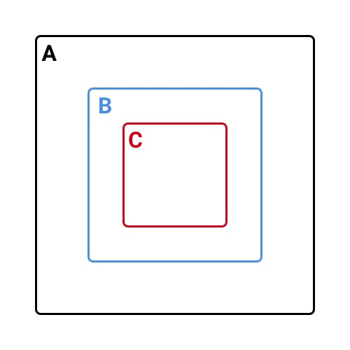

تقریبن ۲ سال پیش بود که تصمیم به مهاجرت گرفته بودم و برای موقعیت شغلی فرانت‌اند دولوپر اپلای کنم که موفقیت‌آمیز هم بود و تونستم جاب‌آفر هم بگیرم ولی بنا به دلایل شخصی‌ای که پیش اومد منصرف شدم. ولی اون مدت با تعداد زیادی از شرکت‌های اروپایی که اغلب آلمان و هلند بودن مصاحبه داشتم که تجربه‌ی خوبی شد برام و با جنبه‌های مختلف مصاحبه آشنا شدم که می‌خوام توی پست‌های مختلف در موردشون بنویسم. اول از همه با جاوااسکریپت قراره شروع کنیم.

# در مورد چی قراره صحبت کنیم؟

به خاطر گستردگی مطالب مباحث رو توی دو پست خواهم نوشت.
پست اول مباحث زیر رو پوشش می‌ده:

- [Scope](#scope)
- [this & binding](#this-binding)
- [Closure](#closure)
- [ماژول‌ها در جاوااسکریپت](#modules)
- [آشنایی با ES6](#es6)

و پست دوم:

- [Prototypes](/frontend-interview-questions-javascript-part-2#prototypes)
- [Async](/frontend-interview-questions-javascript-part-2#async)
- [Event Loop & Call Stack](/frontend-interview-questions-javascript-part-2#event-loop)
- [Types](/frontend-interview-questions-javascript-part-2#types)
- [Coercion](/frontend-interview-questions-javascript-part-2#coercion)

# <a id="scope">Scope</a>

Scope یک کانسپتی هستش که توی اکثر زبان‌های برنامه‌نویسی وجود داره که متغیر‌هایی که تعریف میشه توی برنامه، کجا قراره نگه داشته بشن و برنامه چجوری می‌تونه دسترسی داشته باشه بهشون.



توی تصویر بالا سه تا مربع داخل هم هستن که هر مربع رو یک scope در نظر بگیرید.
با توجه به تصویر بالا می‌بینید که scope‌ها رو میشه به صورت تو در تو هم تعریف کرد. فقط یک نکته‌ای که هستش اینه که هر scope به scopeهای بالاتر خودش دسترسی داره. که **به این رفتار که به scopeهای بالاتر دسترسی داره اصطلاحن lexical scope گفته میشه.**

تا قبل از ES6، فقط فانکشن‌ها بودن که scope جدید می‌ساختن ولی به تازگی که مفهوم **block scoping** هم اضافه شده، می‌تونید بلاک رو با `{}` تعریف کنید (که scope می‌سازن) و از متغیرهای const و let که block scope هستن داخلش استفاده کنید. اتفاقی که میفته اینه که مقادیری که با استفاده از اینا تعریف می‌شه فقط داخل همون scope بهشون می‌شه دسترسی داشت. _(البته برای قبل از es6 هم تکنیک‌هایی وجود داشت برای شبیه سازی block scoping ولی خب الان نیازی نیست واردش بشیم.)_

به عنوان مثال اگه تصویر بالا رو بخوام تبدیل بکنم به کد، با توجه به اینکه فانکشن scope جدید درست می‌کنه به این صورت میشه کد:

```js
function hello() {
  var A = 'Scope 1'

  function world() {
    var B = 'Scope 2'

    function boom() {
      var C = 'Scope 3'
      return `I've access to ${A}, ${B}, ${C}`
    }

    return boom
  }

  return world
}

var sayHelloToWorld = hello()()()

// I've access to Scope 1, Scope 2, Scope 3
console.log(sayHelloToWorld)
```

سه تا فانکشن با نام‌های `hello` و `world` و `boom` داریم که هر کدوم یک scope جدید درست می‌کنن. فانکشن‌های `hello` و `world` دارن فانکشن‌هایی که توی خودشون تعریف می‌کنن بر میگردونن و در نهایت فانکشن `boom` داره یک متن رو که شامل مقدار متغیرهای scopeهای بالاتر میشه رو بر می‌گردونه. به این دسترسی به متغیرهای بالاتر از خودش (اینجا: `A` و `B`) رو lexical scoping می‌گن.

در مورد Block scope هم که توی ES6 اضافه شده یک توضیح مختصری بدم.
به کد زیر دقت کنید:

```js
// es5 way
function oldName() {
  var name = 'Abbas Ghaderi'

  if (1 === 1) {
    var name = 'Shadmehr Aghili'
  }

  return name
}

// es6 way
function modernName() {
  let name = 'Abbas Ghaderi'

  if (1 === 1) {
    let name = 'Shadmehr Aghili'
  }

  return name
}

console.log(oldName()) // Shadmehr Aghili
console.log(modernName()) // Abbas Ghaderi
```

همونطور که گفته شد `let` و `const` بلاک‌اسکوپ هستن و به خاطر همینه که توی شرطی که توی فانکشن دومی نوشتیم چون `name` با `let` تعریف شده و همچنین `if( ... ){ ... }` یک بلاک و اسکوپ جدید درست کرده پس در نتیجه توی همون شرط فقط مقدار رو داره ست می‌کنه و در دسترس هستش. بیرونش دسترسی بهش نداریم.

کد زیر هم توی es6 معتبر و درسته:

```js
{
  let name = 'mojtabast'

  console.log(name) // mojtabast
}

console.log(name) // Uncaught ReferenceError
```

یک مبحث دیگه‌ای هم که توی Scope مطرحه **Hoisting** هستش. **Hoisting یک مفهومی توی جاوااسکریپت هستش که توی زمان کامپایل اتفاق میفته و به اینصورته که تعریف متغیر و یا فانکشن، خود به خود به بالای Scope‌ـی که توش هست منتقل میشه.**

کد زیر رو در نظر بگیرید و اول حدس بزنید که خروجی چیه:

```js
console.log(name) // ?
console.log(lang) // ?

var name = 'mojtaba'
var lang = 'persian'
console.log(name) // ?
console.log(lang) // ?
```

اگر کد رو اجرا کنید می‌بینید که دو تا `console.log` اولی `undefined` رو نشون میدن و دو تای آخر به ترتیب ‍`mojtaba` و `persian`.

دلیلش چیه؟ Hoisting.

در واقع جاوااسکریپت موقع کامپایل کد شما رو به همچین چیزی تبدیل می‌کنه:

```js
var name
var lang
console.log(name) // undefined
console.log(lang) // undefined

name = 'mojtaba'
lang = 'persian'
console.log(name) // mojtaba
console.log(lang) // persian
```

نکته‌ی آخر اینه که دو نوع مقداردهی داریم توی جاوااسکریپت که چون برابر فارسیش رو دقیق نمی‌دونم از انگلیسیش استفاده می‌کنم. اولی **declaration** و **assignment**.

به عنوان مثال:

```js
var a // declaration
var b // declaration
a = 'Hey!' // assignment

// declaration
function hello() {
  // ...
}

// assignment
b = function() {
  // ...
}
```

تفاوت این دو تا رو مهمه بدونید چون **توی hoisting این decalaration‌ها هستن که به بالای scope منتقل میشن.**

این رو در نظر بگیرید:

```js
var name = printName()
var lang = printLang()

console.log(name) // ?
console.log(lang) // ?

function printName() {
  return 'mojtabast'
}

lang = function printLang() {
  return 'persian'
}
```

بعد از Hoisting به این صورت میشه:

```js
// function decalaration
function printName() {
  return 'mojtabast'
}
// variable decalaration
var name
var lang

name = printName()
lang = printLang()

console.log(name) // mojtabast
console.log(lang) // ReferenceError

lang = function printLang() {
  return 'persian'
}
```

### سوالات این بخش

- در مورد Hoisting چی می‌دونی؟
- یک نمونه کد به شما نشون می‌دن که در چند سطح متغیر تعریف شده و یک سری‌هاشون دوباره مقداردهی شدن و ازتون می‌خوان که حدس بزنید هر متغیری مقدارش چیه. یک نمومنه‌ی خیلی ساده‌ش به شکل زیره: توی کنسول چی نمایش داده میشه؟

```js
name = 'Steve'

function hello() {
  console.log(name)

  var name = 'Steve'
}

var name

hello() // undefined
```

- Lexical Scope رو توضیح بده چیه؟
- چه چیزایی توی جاوااسکریپت Scope جدید درست می‌کنه؟
- تفاوت let و const و var رو بگید.

# <a id="this-binding">this & binding</a>

`this` توی جاوااسکریپت بر خلاف زبون‌های دیگه به آبجکتی که توش هست اشاره نمی‌کنه، **در واقع به جایی اشاره می‌کنه که داره ازش صدا زده میشه!**

مثال زیر رو در نظر بگیرید و ببینید که می‌تونید حدس بزنید خروجیا چیا هستن.:

```js
// name is string
// formatter is a callback function
function nameFormatter(name, formatter) {
  formatter(name)
}

var info = {
  // some data
  name: 'mojtaba',
  age: '2048',
  lang: 'persian',

  // some methods
  printLang: function() {
    console.log('Language:', this.lang)
  },
  about: function() {
    this.printLang() // ? (1)

    nameFormatter(this.name, function(name) {
      var formattedName = name + '-->' + this.age

      console.log(formattedName) // ? (2)
    })
  },
}

info.about()

var copyPrintLang = info.printLang
copyPrintLang() // ? (3)
```

اینجا یک آبجکتی داریم به اسم `info` که توش یک سری اطلاعات داریم و یک سری متد برای دسترسی به اونا. کنار یک سری هاشون علامت سوال گذاشتم و شماره‌گذاری کردم. با توجه به شماره گذاری‌ها توضیحات رو میدم.

مورد ۱: اینجا مقدار ‍‍`persian` نمایش داده میشه چون از `info.about()` داره صدا زده میشه و اینجا `this` اشاره داره به آبجکت ‍`info` که توش `lang` برابر با `persian` ست شده.

مورد ۲: اگه به فانکشن `nameFormatter` دقت کنید می‌بینید که یک فانکشن رو به عنوان آرگومنت دوم داره می‌گیره و همونجا داخل خودش صداش می‌زنه. بنابراین فانکشنی که داریم توی مورد پاس می‌دیم توی `nameFormatter` صدا زده میشه نه `about`. توی فانکشنی که داریم پاس میدیم `this.age` داریم که اینجا `this` به ‍‍`window` یا `global` داره اشاره می‌کنه که اونجا چون متغیری به اسم age نداریم بنابراین `undefined` میشه. دلیلش هم اینه که چون فانکشن توی `nameFormatter` داره صدا زده میشه و `nameFormatter` چون بیرون از آبجکت `info` هستش پس `this` به `window` اشاره می‌کنه. در نتیجه چیزی که نمایش داده میشه توی مورد دوم `mojtaba-->undefined` خواهد بود.

مورد ۳: ما یک کپی از متد `printLang` گرفتیم که توش `this.lang` رو توی کنسول نمایش قراره بده. اینجا مقداری که بر میگردونه ‍`Language: undefined` خواهد بود چون `this` اینجا به `window` اشاره میکنه نه به `info`. بخوام خلاصش کنم موقع صدا زدن به قبل از نقطه نگاه کنید `this` به همون اشاره میکنه. اینجا چون فانکشن رو ریختیم توی یه متغیر و با استفاده از متغیر داریم صدا می‌زنیم فانکشن رو بنابراین به `window` اشاره میکنه.

`this` توی جاوااسکریپت نکات مختلفی داره که سعی کردم خیلی خلاصه بهش اشاره کنم ولی حتمن این تاپیک رو چندین مقاله بخونید در موردش که کامل مسلط باشید. یکی از منابع [این مطلب MDN](https://developer.mozilla.org/en-US/docs/Web/JavaScript/Reference/Operators/this) هست.

مبحث آخری که میخوام در موردش صحبت بکنم توی این سکشن **Binding** هستش. مهم‌ترین متدی که وجود داره براش [**`bind`**](https://developer.mozilla.org/en-US/docs/Web/JavaScript/Reference/Global_objects/Function/bind) هستش. کاری که این متد می‌کنه اینه که شما می‌تونید براش ست کنید که this به چی اشاره کنه توی فانکشن. یک نکته‌ای که وجود داره وقتی از `bind` استفاده می‌کنید در واقع یک فانکشن جدید ساخته میشه عین همون فانکشن خودتون با این تفاوت که `this` به چیزی که شما تعیین کردید اشاره میکنه، نه از جایی که صدا زده می‌شه.

مثال بالا رو با bind بازنویسی می‌کنم:

```js
var copyPrintLang = info.printLang
copyPrintLang() // ‍Language: undefined

var copyPrintLangWithBind = info.printLang.bind(info)
copyPrintLangWithBind() //  ‍Language: persian
```

دو تا متد کاربردی دیگه هم [`apply`](https://developer.mozilla.org/en-US/docs/Web/JavaScript/Reference/Global_Objects/Function/apply) و [`call`](https://developer.mozilla.org/en-US/docs/Web/JavaScript/Reference/Global_Objects/Function/call) که علاوه بر ست کردن this یا همون context شما می‌تونید آرگومنت‌ها رو پاس بدید و فانکش رو صدا بزنید. تفاوت این دوتا با هم اینه که `apply` آرگومنت‌هارو به صورت آرایه می‌گیره ولی `call` به همون صورت آرگومنت دونه دونه باید ست کنید. مثال:

```js
var personalInformation = {
  name: 'mojtaba',
  printInfo: function(location, website) {
    console.log('Info:', this.name, location, website)
  },
}

// Copy function from object so we need set context
var info = personalInformation.printInfo

// We passed two needed arguments using apply and set `personalInformation` as context
info.apply(personalInformation, ['World', 'http://www.mojtababast.com']) // Info: mojtaba, World, http://www.mojtababast.com

// Same, but using call instead of apply
info.call(personalInformation, 'World', 'http://www.mojtababast.com')

// You can also pass some of arguments, not all of them using bind
// First I passed the first argument then you should pass the second argument whenever you want use that function
var presetInfo = info.bind(personalInformation, 'World')
presetInfo('http://www.mojtababast.com') // Info: mojtaba, World, http://www.mojtababast.com
```

### سوالات این بخش

- this توی جاوااسکریپت چطوری کار می‌کنه؟
- یک نمونه کد مثل کدهای مثال بالا بهتون می‌دن و می‌گن که اینجا this به کجا اشاره می‌کنه و خروجی چیه؟
- تفاوت bind, apply و call چیه؟
- چطوری می‌تونیم this یک آبجکت رو تغییر بدیم؟ در واقع وقتی از this استفاده می‌کنیم توی یک آبجکتی، چطوری می‌تونیم اون رو تغییر بدیم که یک چیز دیگه اشاره کنه.

# <a id="closure">Closure</a>

بهترین توصیف رو به نظرم [Kyle Simpson](https://github.com/getify) داره که میگه:

> Closure فانکشنیه که Lexical scopeـش رو یادش می‌مونه حتی زمانی که خارج از Lexical scopeـش اجرا بشه.

یعنی چی؟ مثال زیر رو توجه کنید:

```js
function countries() {
  var list = {
    IR: 'IRAN',
    USA: 'United States',
    DE: 'Germany',
    FR: 'France',
  }

  return function(code) {
    console.log(list[code])
  }
}

function getCountry() {
  var countriesList = countires()
  var selectedCountry = countriesList('IR')

  return selectedCountry
}

getCountry() // Iran
countries()('DE') // Germany
```

همونطور که می‌بینید فانکشنی از ‍`countries` داره برمیگرده رو ما هم داخل یه فانکشن دیگه (getCountry) استفاده کردیم هم مستقیمن ولی می‌بینیم که هر جا که اجراش داریم می‌کنیم به `list` دسترسی داره که توی فانکشن پدرش هستش (‌اصطلاحن توی lexical scopeـش هست).

برای اینکه عمیق‌تر بشید روش کلی مقاله‌ی خوب انگلیسی هستش که راحت می‌تونید پیدا کنید و اگر فرصت بشه در یک پست جداگونه منم بهش می‌پردازم چون هم خیلی استفاده میشه و هم اینکه خیلی مهمه به نظرم که درک بشه کامل.

یک تاپیک دیگه هم که هست توی این مبحث **Higher Order Function** هستش که اونم توصیه می‌کنم با مفهومش آشنا بشید.

### سوالات این بخش

- closure چیه؟ چه وقتایی استفاده می‌تونیم بکنیم ازشون؟
- higher-order function چیه؟
- ممکنه یک مشکلی رو مطرح کنن و یک سوالی مطرح کنن و به شما بگن کدش رو بنویسید، اونجا Closure مجبور شید بنویسید.

# <a id="es6">ES6</a>

این تاپیک رو اگه بخوام پوشش بدم کامل خیلی طول پست طولانی میشه و اینجا خیلی خلاصه‌وار و کوتاه اشاره می‌کنم بهشون. در آینده ولی به صورت پست‌های مجزا سعی می‌کنم در موردشون بنویسم. توی نسخه‌ی جدید جاوااسکریپت (که خیلیم جدید نیست البته دیگه) یک سری ویژگی‌ها اضافه شده که شما هم نیازه باهاشون آشنا باشید و استفاده کنید در صورت نیاز.

- **Block Scope**, **const** & **let**: در مورد بلاک اسکوپ بالاتر توضیح دادم و علاوه بر `var` می‌تونید از `let` و `const` برای تعریف متغیر استفاده کنید که هم بلاک‌اسکوپ هستن و هم اینکه `const` رو شما نمی‌تونید reassignment _(مفهومش به فارسی میشه «دوباره مقداردهی کردن» اگه اشتباه نکنم)_ کنید.
- **Class**: این ویژگی بیشتر به نظرم Sugar Syntax هستش و ممکنه یکم گیج‌کننده هم باشه چون کلاس توی جاوااسکریپت نحوه‌ی عملکردش با زبون‌های برنامه‌نویسی دیگه فرق میکنه. پس صرفن اینو در نظر داشته باشید که کلس‌ها توی جاوااسکریپت دقیقن همون Function Constructorهایی هستن که شما توی ES5 می‌نوشتید. و از همون مکانیزم prototypeها استفاده می‌کنه.
- **Template Literals**: که در واقع می‌تونه شامل string‌هایی چندخطی باشه و داخلش می‌تونید اکسپرشن هم داشته باشید.

```js
var name = 'Mojtaba'
var info = `My name is ${name}, Welcome to my blog.`
console.log(info) // My name is Mojtaba, Welcome to my blog.
```

- **Tagged template literals**: ما می‌تونیم استرینگ رو و مقادیری که توش هست رو پاس بدیم به یک فانکشن و اون برامون string رو بر گردونه.

```js
function nameFormatter() {
  //...
}
var name = 'Mojtaba'
var info = nameFormatter`My name is ${name}, Welcome to my blog.`
console.log(info)
```

اینجا خود string و مقدار `name` به فانکشن `nameFormatter` فرستاده می‌شه و اون برامون متن رو تولید باید کنه. [Styled Components](https://www.styled-components.com/) هم اگر آشنا باشید باهاش از همین ویژگی داره استفاده می‌کنه. توضیحات بیشتر رو از [این پست وبلاگی](https://wesbos.com/tagged-template-literals/) می‌تونید مطالعه کنید.

- **Arrow functions**: یک شیوه‌ی جدیدی که میشه فانکشن درست کرد و تفاوتش با بقیه اینکه که `this` به اسکوپ بالاسریش اشاره می‌کنه و دیگه اسکوپ جدید نمی‌سازه که به اسکوپ خود فانکشن اشاره کنه. این مورد رو خیلی احتمالن توی اضافه کردن event listener به یک المنتی توی صفحه دیدید و مجبور بودید `this` رو توی یک متغیر دیگه (معمولن `that` میذاشتن اکثرن) بذاریمش. یا اینکه از `bind` استفاده می‌کردید.

```js
function blahblah() {
  var btn = document.querySelector('.button')
  var that = this
  btn.addEventListener(function() {
    that.handleClick()
  })
}
```

که الان با arrow function میشه راحت‌تر حلش کرد.

```js
function blahblah() {
  var btn = document.querySelector('.button')
  btn.addEventListener(() => {
    this.handleClick()
  })
}
```

- **Promise & async await**: جاوااسکریپت موقع اجرا برای چیزی صبر نمی‌کنه و `asynchronize` هستش که خیلی سادش این میشه: فلان کارو انجام بده و هر وقت خبری شد بهمون بگو. به عنوان مثال یک ریکوئست می‌زنید به سرور و ۱۰ ثانیه طول می‌کشه، طبیعتن کل برنامه نباید متوقف بشه و باید هر وقت از سرور پاسخی گرفتیم باخبر بشیم و متقابلن کاری رو همون لحظه فقط انجام بدیم. شیوه‌ی قدیمیش این بود که یک فانکشن به عنوان کال‌بک ست می‌کردی و هر موقع اون کار انجام میشد، تهش این کال‌بک صدا زده میشد. بعدش **Promise** اضافه شد که خیلی راحت به صورت زنجیره‌وار می‌تونسید کارا رو انجام بدید و همینطور یک سری ویژگی‌های دیگه. اخیرن هم [async await](https://alligator.io/js/async-functions/) اضافه شده که خیلی تمیزتر و بهتر هستش استفادش به نظرم.
- **Destructing**:با این ویژگی و سینتکس جدید جاواسکریپت می‌تونید خیلی راحت از یک آبجکت چیزایی که می‌خواید رو بکشید بیرون و بریزید توی متغیری به همون اسم. به نمونه‌ی زیر دقت کنید:

```js
var countries = {
  IR: 'IRAN',
  USA: 'United States',
  DE: 'Germany',
  FR: 'France',
  Africa: {
    GH: 'Ghana',
  },
}
var {
  IR,
  USA,
  Africa: { GH },
} = countries

console.log(IR, USA, GH) // IRAN United States Ghana
```

- **Rest** & **spread**: همونطور که می‌بینید سه نقطه خیلی کاربردای باحالی پیدا کرده که دو تا دیگه از کاربرداش هم توی مثال زیر می‌تونید ببینید.

```js
var africa = {
  GH: 'Ghana',
  SA: 'South Africa',
}

var europe = {
  DE: 'Germany',
  FR: 'France',
}
var countries = {
  IR: 'IRAN',
  USA: 'United States',
  ...africa, // Spread Operator
  ...europe, // Spread Operator
}

// Resting Operator
var { IR, ...restOfCountries } = countries

console.log(countries)
/*
{

  IR: 'IRAN',
  USA: 'United States',
  GH: 'Ghana',
  SA: 'South Africa'
  DE: 'Germany',
  FR: 'France',
};
*/
console.log(IR) // IRAN
console.log(restOfCountries)
/*
{
  USA: 'United States',
  GH: 'Ghana',
  SA: 'South Africa'
  DE: 'Germany',
  FR: 'France',
}
*/
```

- **Iterators**: یک مکانیزم جدیدی اضافه شده به جاوااسکریپت که می‌تونید باهاش توی دیتا پیمایش کنید. بحث جالب و طولانی هستش که یک پست جداگانه براش می‌نویسم در آینده و اینجا لینکش رو می‌ذارم.
- **Generators**: یکی از دوست‌داشتنی‌ترین ویژگی‌هایی که اضافه شده و خب اینم پست جداگانه براش خواهم نوشت ولی خب یک مختصری توضیح بدم در موردش. فانکشن‌هایی هستن که میشه Pause و Resumeشون کرد. سینتکسش هم به این صورته:

```js
function* i_am_a_function_generator() {
  // ...
}
```

### سوالات این بخش

به طور کل بسته به نیازهای پروژه‌ای که دارن روش کار می‌کنن از یک سری ویژگی‌ها بیشتر استفاده می‌کنن و خب طبیعتن از همون بخش بیشتر سوال می‌کنن. به عنوان مثال یکی از شرکتایی مه مصاحبه داشتم از `redux-saga` استفاده می‌کردن و همونطور که می‌دونید برای کار باهاش باید از فانکشن جنریتور ها استفاده کنید و سوال‌هایی هم ازش پرسیدن. ولی باقی جاها نمی‌پرسیدن زیاد در موردش.

- فرق arrow function با فانکشن معمولی چیه؟
- یعنی چی که function generator ها رو میشه pause و resume کرد؟ یعنی سی‌پی‌یو رو بلاک می‌کنه؟
- جاوااسکریپت asynchronize هستش، چه راهکارهایی براش هست؟ فرق هرکدوم با هم چیه؟

# <a id="modules">Modules</a>

به طور کلی به چندین شکل در جاوا اسکریپت می‌تونید ماژول بنویسیم که چندتا از محبوب‌ترین‌هاشون رو پایین‌تر می‌نویسم:

- IIFE Pattern
- CommonJS
- AMD
- ES6 Modules

همونطوری که می‌دونیم ماژول‌ها با این هدف درست میشن که کار به قسمت‌های کوچک‌تری شکسته بشه و هر قسمتی به صورت مجزا یک کاری رو انجام بده. اینطوری هم نگهداری و توسعه کار راحت‌تره و هم اینکه چون encapsulate هستن به مشکلات ناخواسته‌ای نمی‌خورید مثل مشکلات تداخل کدها و اسم‌گذاری متغیرها.

### IIFE

IIFE مخفف immediately invoked function expression هستش و ایفی خونده میشه. حالا چرا این اسم؟

```js
var fn = function(name) {
  return name
}
```

این رو بهش اصطلاحن می‌گیم function expression. در واقع اینجا declare نکردیم فانکشن رو همونطور که بالاتر توضیح دادم. پس مثل یک مقدار ببینیدش. immediately invoked هم یعنی اینکه بلافاصله داره صدا زده میشه و اجرا میشه. که منظور از این عبارت دقیقن یعنی یک فانکشنی رو تعریف کنیم که بعدش بلافاصله اجراش بکنیم. که میشه به صورت زیر:

```js
;(function() {
  // your code
})()
```

این چه کمکی می‌کنه؟ همونطور که گفتم توی جاواسکریپت فانکشن هستش که اسکوپ جدید درست می‌کنه به همین خاطر اینجا ما در واقع کدارو داخل این فانکشن می‌ذاریم و کدای داخلش encapsulate یا ایزوله میشن و در نهایت این فانکشن به ما یک API یا اینترفیس میده که میتونیم از ماژول instance بگیریم و ازش استفاده کنیم. این تکنیک یک سری نکات پرفورمنسی و شیوه‌های متفاوتی در نوشتن هم داره که می‌تونید با یک سرچ پترن‌های مختلفش رو ببینید و آشنا شید باهاش.

### CommonJS

تا قبل از ES6 جاوااسکریپت خودش مکانیزمی واسه ماژول‌ها نداشت به خاطر همین یکی از مهندسای موزیلا اومد و یک مکانیزمی رو با یک سری از استانداردای خودش طراحی کرد. دو سه سال بعد Node.js اونو پیاده‌سازی کرد برای خودش و توی اون اکوسیستم وارد شد. منتها موقع طراحی این مکانیزم سمت سرور ملاک قرارداده شده _(حتی توی نسخه‌ی ابتداییش هم اسمش ServerJS بوده که بعد تغییر نام داده شد به CommonJS)_ به خاطر همین یک سری مشکلات برای مرورگر و سمت کاربر داره که مهم‌ترینش در نظر نگرفتن امکان Asynchronize بودنش هست. و در آخر این رو هم اضافه بکنم که CommonJS فقط یک مکانیزمی برای ماژول نبوده بلکه یک پروژه‌ای بوده با این هدف که یک سری API‌های متداول رو به جاوااسکریپت اضافه کنه که [ماژول](http://wiki.commonjs.org/wiki/Modules/1.1) هم یکی از بخشاش بوده. نمونه:

```js
// test.js
exports.name = 'Mojtaba'
exports.website = 'https://mojtabast.com/'

// index.js
const { name, website } = require('test')
```

### AMD

AMD مخفف Asynchronous Module Definition هستش که اینم یک مکانیزمی هستش با این تفاوت که ییشتر مرورگر رو ملاک قرار داده شده. در واقع علاوه بر مزیت‌های CommonJS یک سری بهینه‌سازی‌ها انجام شده توی این مکانیزم که به انتخاب بهتری برای مرورگر تبدیلش کرده. معروف‌ترین پیاده‌سازی از این مکانیزم [RequireJS](https://requirejs.org/) هستش که توصیه می‌کنم یک نگاهی بهش بندازید اگر آشنا نیستید. یک نمونه کد از مستندات خود RequireJS قرار می‌دم:

```js
//Calling define with a dependency array and a factory function
define(['dep1', 'dep2'], function(dep1, dep2) {
  //Define the module value by returning a value.
  return function() {}
})
```

### ES6 Modules

توی ES6 بالاخره خود جاوااسکریپت یک مکانیزمی رو برای ماژول‌ها در نظر گرفت. سینتکس ساده‌ای هم داره و به راحتی میشه ازش استفاده کرد.

```js
// hello.js
function say() {
  return 'hello'
}

export default say

// app.js
import sayHello from './hello'

document.write(sayHello())
```

و توی HTML به این صورت استفاده میشه:

```html
<script type="module" src="app.js"></script>
```

خروجی کار رو می‌تونید [اینجا](https://codesandbox.io/s/jv8o637jxy) مشاهده کنید.
این روش به نظرم بهترین روشه چون ویژگی خود جاوااسکریپت هستش ولی چند سالی زمان می‌بره که کامل جا بیفته، هر چند که توی مرورگرای مدرن تقریبن به خوبی ساپورت میشه و Node.js هم مدتیه که داره ساپورت می‌کنه (البته روی یک سری از تاپیکاش توی نحوه‌ی پیاده‌سازی هنوز دارن بحث می‌کنن). ولی در کل توصیم اینه که با توجه به وضعیت الان ES6 Modules و CommonJS پترن رو همزمان بلد باشید می‌تونه کافی باشه.

### سوالات این بخش

- چطوری کدتون رو سازماندهی و مدیریت می کنید؟
- تفاوت CommonJS و AMD چیه؟
- چطوری توی جاوااسکریپت می‌تونیم ماژول بنویسیم؟
- چطوری می‌تونیم کدی رو بین قسمتای مختلف پروژه Share کنیم؟
