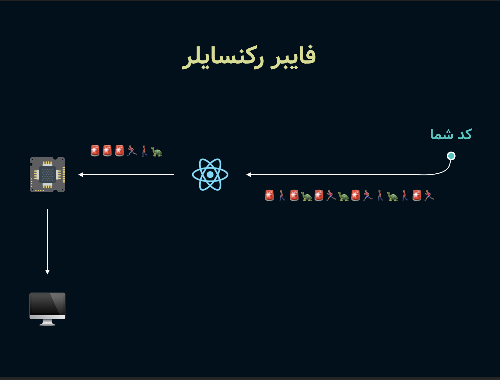
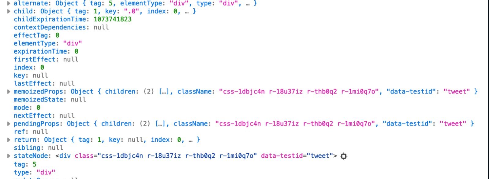
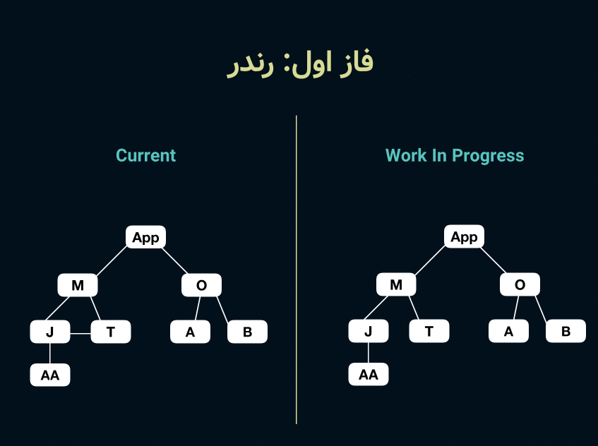

هفت شهریور امسال برای [ری‌اکت کانف](https://reactconf.ir/) یک ارائه رو آماده کرده بودم (که می‌تونید از [اینجا ببینید](https://www.youtube.com/watch?v=P84C_Tj3Py0)) و توش در مورد این صحبت کردم که ری‌اکت کلن چجوری داره کار می‌کنه و چه محدودیت‌هایی داشته و با نسخه‌ی ۱۶ چجوری این موارد رو پوشش دادن. یه بحث خیلی جذابی بود ( حداقل برای خودم ) و سعی کردم که مطلبی که آماده میکنم جوری باشه که بخش عمده‌ای از آدم‌ها بتونن ازش استفاده کنن و همینطور اطلاعاتی رو به اشتراک بذارم که منابع کمتری هست براش (انگلیسی هم خیلی کم پیدا میشه براش، چه برسه به فارسی که کلن چیزی پیدا نکردم). خوشبختانه از لحاظ محتوا تونستم به چیزی که دل‌خواهم هست برسم و از همون اول هم هدفم این بود که بعدش توی یه پست بنویسمش که هم راحت‌تر بشه بهش دسترسی داشت و هم سریع‌تر بشه ازش استفاده کرد و هم جزییاتی که توی ارائه نمیشد رفت سراغش رو اینجا بیشتر در موردش بحث بکنم.

مدت زیادی بود که پیش‌نویس کرده بودم این مطلبو ولی فرصت نشده بود تمومش کنم. گفتم به مناسبت روز تولدم تمومش کنم و منتشرش کنم. خودمم نمیدونم چه ربطی دارن به هم ولی خب :))

برو بریم.

# چرا از ری‌اکت استفاده کنیم؟

ری‌اکت مزیتی که داره ارائه می‌ده اینه که بین کد شما و رابط کاربری‌تون قرار میگیره و به شکل بهینه‌ای آپدیت‌های رابط کاربری رو براتون هندل میکنه. خب اصولن چه نیازی هست بهش؟

۱. یک سری ویژگی داره که کار شما رو برای مدیریت رابط کاربری خیلی راحت میکنه به عنوان مثال به شما قابلیت اینو میده که استیت (state) تعریف بکنید و هر وقت استیت تغییر کرد خودش بیاد فقط همون قسمت مربوطه رو براتون آپدیت/رندر بکنه.

۲. این آپدیت‌ها رو به شکل بهینه‌ای براتون انجام میده به عنوان مثال توی مرورگر کار کردن با DOM و تغییرات DOM برای مرورگر خیلی هزینه‌بر هستش و خیلی باید با دقت اینکار انجام بشه چون به مشکلات پرفورمنسی می‌خورید اکثر اوقات. یکی از کارهایی که ری‌اکت میکنه اینه که میاد میبینه چیا قراره تغییر کنه، این تغییرات رو محاسبه میکنه , میاد صرفن همونارو توی DOM آپدیت میکنه. اگر هم که تغییری نکرده باشه، دست بهشون نمیزنه کلن.

# ری‌اکت چجوری کار میکنه؟

چیزی که ما در مجموع به عنوان ری‌اکت استفاده می‌کنیم از چندتا پکیج تشکیل شده. اولیش خود پکیج ری‌اکت هستش که در واقع وظفیش تعریف کردن رابط کاری (UI) هستش. یعنی شما یک رابط کاربری رو در نظر بگیرید با استفاده از ری‌اکت می‌تونید هر المنت (جز) رو تعریف کنید و بگید که چیه و نسبتش به بقیه‌ی المنتا چیه. هیچ کدوم از ویژگی‌های که ما ازش داریم استفاده می‌کنیم توی خود ری‌اکت پیاده‌سازی نشدن و به بیان ساده تر میشه گفت یک تعدادی آبجکتی هستن که قراره رابط کاربری شما رو شکل بدن.
باز بخوام ساده‌ترش کنیم، خود ری‌اکت رو مثل یه پروتکل یا استاندارد باید ببینیم، یه سری اصول و قواعد و مفاهیم داره که شما می‌تونید بر اساس این پروتکل، رابط کاربری رو تعریف و پیاده‌سازی کنید.

خب حالا که خود ری‌اکت هیچ کدوم از ویژگی رو داخل خودش پیاده‌سازی نکرده، داستان چیه؟ پس این چیزی که ما داریم توی محیطای مختلف مثل مرورگر و موبایل می‌بینیم از کجا دارن میان؟ مگه یه سری آبجکت نبودن؟
جواب این سوالا اینه که این پروتکل یا هر چی که اسمش رو بذاریم یه چیز استاندارد و ثابتیه که ما با استفاده ازش می‌تونیم اون قابلیت‌ها رو پیاده‌سازی کنیم و تبدیلش کنیم به رابط کاربری یا به اصطلاح رندرش کنیم در نهایت. همونطور که می‌دونید در حال حاضر ری‌اکت توی پلتفرم‌های مختلفی داره رندر میشه از جمله مرورگر، موبایل، VR و حتی کنسول مرورگر و خیلی جاهای‌های دیگه.
ری‌اکت برای این رندر شدن توی محیط‌های مختلف یه مفهومی رو به نام رندرر معرفی کرده ( renderer ) که وظیقش اینه که اون ابجکتایی که ری‌اکت درست کرده رو تبدیل کنه به رابط کاربری واقعی و چیزی که در نهایت کاربر داره می‌بینه. رندررهای مختلفی هم وجود داره که همونطور که گفتم توی محیط‌های مختلف ری‌اکت رو دارن رندر میکنن. به عنوان مثال react dom میاد توی مرورگر رندر میکنه، [react native](https://facebook.github.io/react-native/) میاد توی موبایل رندر میکنه، [ink](https://github.com/vadimdemedes/ink) توی کامند لاین رندر میکنه و خیلی محیطای دیگه. رندررها علاوه بر این مسئولیت خطیری که در تبدیل ری‌اکت به رابط کاربری دارن یک سری ویژگی‌های بیشتر هم دارن برای ما پیاده‌سازی میکنن. همونطور که گفتیم خود ری‌اکت هیچ ویژگی‌ای رو توی خودش پیاده‌سازی نکرده. به عنوان نمونه hooks و لایف‌سایکل‌ها و … همه توی رندررها پیاده سازی شدن. پس حواستون باشه که اگه می‌خواید کدای خود ری‌اکت رو بخونید،این چیزارو اگه مدنظر داشته باشید خیلی راحت‌تر می‌تونید پیدا بکنید که توی خود ری‌اکت هر ویژگی چجوری پیاده‌سازی شده. مثل من چهار ساعت نمیرید توی پکیج ری‌اکت دنبال هوک بگردید آخرشم پیدا نکنید. 🤷🏽‍♂️

همونطور که گفتم رندررهای زیادی وجود داره و ری‌اکت توی هر محیطی می‌تونه رندر بشه. خب این رندررها یه تشابهاتی دارن با هم. همشون باید با یک الگوریتمی این تغییرات رو محاسبه کنن و انجام بدن، همشون یک سری ویژگی مثل hooks و state و … رو باید داشته باشن. خب از اونجایی که ما همگی برنامه‌نویس هستیم و تنبل، بهترین راه چیه؟ بهترینش اینه که این مشترکات رو یه پکیج جدا کنیم و اسمش رو بذاریم رکنسایلر (reconciler) و همونو همه جا استفاده کنیم. نه؟

پس رکنسایلر در واقع وظیفه‌ی این مدیریت آپدیت‌ها و لایف‌سایکل‌ها و محاسبه‌ی تغییرات و … رو برعهده داره و خب این چیزی نیست که مرتبط به محیط باشه و همه جا یک جور انجام داره میشه. همه‌ی رندررها هم میان از این پکیج استفاده میکنن که نیاز نباشه هی همه چیو از دوباره بنویسن و کار اصلی رندررها این میشه که تو محیطی که قراره رندر بشن یک سری تنظیمات ارائه می‌دن به رکنسایلر و چیزایی که فقط مختص به همون محیطه رو در نهایت پیاده سازی میکنن مثلن توی react dom میان اون درخت ری‌اکت رو تبدیلش میکنن به DOM و DOM چیزی هستش که مرورگر میفهمه.

### جمع‌بندی این بخش

خب یک جمع‌بندی تا اینجا بخوایم بکنیم سه تا چیز عمده رو ما اینجا فهمیدیم:

۱. ری‌اکت توی خودش ویژگی‌ها رو پیاده‌سازی نکرده و صرفن رابط کاربری رو باهاش میشه تعریف کرد.

۲. رندرر میاد این تعاریفی که از ری‌اکت گرفته رو برای ما توی محیط‌های مختلف رندر میکنه. مثل مرورگر که از رندرر react dom استفاده میکنه.

۳. این رندررها یک سری مشترکات دارن که توی همشون یکیه، به جای اینکه هی کپی پیست بکنن، یک پکیجش کردن و توی همه جا دارن استفاده می‌کنن و حالشو می‌برن که بهش میگن رکنسایلر.

خب حالا که اینارو متوجه شدیم، یک خورده قضیه رو جدی‌ترش کنیم و بریم سر وقت ری‌اکت ۱۶. برای اینکه درکش کنیم اول باید بفهمیم که مشکل نسخه‌ی قبلی چی بوده که حالا اینا اومدن به کل همه چیو ترکوندن و از اول نوشتنش.

# ری‌اکت ۱۵ چجوری کار می‌کرد و محدودیت‌هاش چی بود؟

توی ورژن ۱۵ ری‌اکت از یه رکنسایلری به اسم استک رکنسایلر ( stack reconciler ) استفاده میشد که در واقع همونطور که احتمالن بدونید استک یک دیتا استراکچری هستش که خود جاوا اسکریپت/مرورگر توی لایه‌های مختلف ازش استفاده میکنن که یکی از معروف‌ترین‌هاش [Call Stack](/frontend-interview-questions-javascript-part-2) هستش. استک یک تعریف خیلی ساده‌ای هم داره. «اولین چیزی که به استک اضافه میشه، آخرین چیزیه که از استک خارج میشه». به عنوان مثال اگر توی استکمون همچین چیزی داشته باشیم:

```
a
a → b
a → b → c
a → b → c → d
a → b → c
a → b
a

```

به صورت کد بخوایم درش بیاریم یک همچین چیزی میشه::

```js
a(b(c(d())))
```

همونطور که می‌بینید برنامه از `a` شروع میکنه و هی میره جلو تا به d میرسه و چون ته خط اونجاست، `d` رو جی اس محاسبه میکنه و از استک خارج میشه، و بعد `c` و به همین ترتیب ادامه پیدا میکنه تا برسه به `a`.

اینارو به این گفتم که ری‌اکت هم از همین مدل استفاده میکرد چون در واقع جاوااسکریپت همینه کال استکش. یعنی این درختی که از رابط کاربری می‌ساخت، از اون سر شروع میکرد تا اون ته به صورت recursive (مثل نمونه بالا) پیمایش (traverse) می‌کرد.

خب دو تا مشکل اساسی داشت این کار:‌

۱. جاوااسکریپت سینگل ترد (single thread) هستش و به این معنیه که در لحظه می‌تونه فقط یک کار رو انجام بده. ری‌اکت کل درختی که ساخته بود رو باید پیمایش می‌کرد و این باعث میشد که یک کار گنده بره توی ترد (thread) و چون کار گندس ترد رو تا تموم شدنش بلاک می‌کنه. یعنی اگه در همون حین جاوااسکریپت چیزی رو میخواست اجرا کنه، باید صبر می‌کرد تا اون کار گندهه تموم شه و بعد بتونه کار بعدی رو انجام بده.

۲. موقع پیمایش کردن درخت هر تغییری که تشخیص میداد رو مجبور بود که همون لحظه روی DOM اعمال کنه. و این به این معنیه که فرض کنید اگر ۵ تا تغییر توی درخت تشخیص میداد، این ۵ تا رو دونه دونه و جداگونه اعمال میکرد. در صورتی که اگه یه راهی بود که این ۵ تا رو با هم اعمال میکردیم خیلی بهینه‌تر میشد. نه؟

حالا بماند که موقع پیمایش اگه اون وسطا به مشکل میخورد به خاطر اینکه یک کامپوننت به مشکل/خطا خورده،‌مجبور میشد کل درخت رو بیخیال شه. یعنی منظورم اینه که مثلن یه کامپوننتی که داره توی هدر استفاده میکنید و به مشکل میخوره عملن هیچ ربطی به اکثر کامپوننت‌های اپ نداره مثل کامپوننت‌هایی که توی بدنه یا ستون‌ها دارن استفاده میشن. در واقع اونا باید رندر بشن ولی خب مجبور بودن به دلیل این محدودیت به پاش بسوزن و بسازن و رندر نشن.

این یه لیستی از محدودیت‌هاش هست:

- توانایی شکوندن کارها به قسمت‌های کوچک
- توانایی قابلیت اولویت‌بندی کارها و انجام دادنشون بر اساس اولویت
- توانایی متوقف کردن کارها حین انجام و ادامه‌دادنشون در یک زمان دیگه
- توانایی بازگردوندن (return) چندتا المنت
- پشتیبانی بهتر از ارورها

# راه حل؟ فایبر.



خب برای حل این مشکل [جردن واک](https://twitter.com/jordwalke) ( خالق ری‌اکت) یه توییتی سال ۲۰۱۴ کرده بود که دارن روی یه راه حلی کار میکنن که این مسائل رو پوشش بده. یعنی از اون موقع تا سال ۲۰۱۶ دو سالی رو زمان گذاشتن و هی آزمون و خطا کردن تا رسیدن به فایبر. ایده از جردن بود و [سباستین مارک‌بیج](https://twitter.com/sebmarkbage) لید پروژه شد و شروع کردن توی ری‌اکت ۱۶ به صورت آزمایشی پیاده‌سازی کردنش. ( اگه دوست دارید تاریخچه‌ی ری‌اکت رو نگاه کنید [این لینک میتونه کمک کنه](https://blog.risingstack.com/the-history-of-react-js-on-a-timeline/))

توی نسخه‌ی ۱۶ ری‌اکت علاوه بر اون مدیریت کردن آپدیت‌ها و کارایی که قبلن میکرد، تغییر رویکرد داد به این که خودش یه واسطی بشه بین کد شما که قراره اجرا بشه و main thread. به این صورت که خیلی سر مین‌ترد رو شلوغ نکنه که تجربه‌ی کاربری روونی رو به کاربر ارائه بده و لگی چیزی هم نداشته باشه. خب این به شکل عملیه؟ ری‌اکت باید می‌تونست که پردازش‌ها و کارهایی که انجام می‌ده رو به قسمت‌های کوچک‌تر بشکونه، باید می‌تونست اولویت هر کاری رو مشخص کنه و به ترتیب اولویت انجام بده و همینطور بدونه که هر کاری چقدر زمان می‌بره که بر اساس اون بتونه برنامه‌ریزی کنه که چه کاری رو فرصت داره انجام بده و چی اولویت داره.

همونطور که قبلن گفتیم استک رکنسایلر یهو میومد کل درخت رو پیمایش می‌کرد و ترد اصلی رو بلاک می‌کرد. از اونجایی که تمام محدودیت‌ها از این میومد که از دیتا استراکچر استک استفاده میشد خب باید یه چیزی جاش پیدا میکردن.
چیکار کردن به جاش؟

### ویرچوال استک

خب همه چیو ویرچوال کردن، استک رو هم ویرچوال کردن رفت :دی چرا؟
استک خود جی اس پاسخگوی یک سری از نیازهای ری‌اکت نیست. نیاز ری‌اکت چی هست حالا؟

- بتونه کارهاش رو قسمت‌های کوچک‌تر بشکونه ( مثلن نیاد یهو کل درخت رو پیمایش کنه یا تغییرات همرو یه جا محاسبه کنه)
- بتونه اولویت بندی کنه کارهاشو و چیزایی که مهم‌تره رو انجام بده اول.

این ویرچوال استک در واقع همون فایبر هستش.

حالا خود فایبر چیه؟ [فایبر یک دیتا استراکچر](<https://en.wikipedia.org/wiki/Fiber_(computer_science)>) هستش. فایبر یه بازسازی/نویسی کال استکه که بهش این قابلیت رو بدیم که pause بشه و سوییچ بشه به چیزای دیگه و همینطور بشه بعدن بهش برگشت و اجراش کرد دوباره که ادامه بده. هر یه آبجکت فایبر هم یک فریم (frame) ویرچوال استک هست.

اتفاقی که توی فایبر میفته اینه که درخت به تیکه‌های کوچیک‌تر شکسته میشه و هی تیکه تیکه می‌ده به ترد اصلی که اون تیکه رو انجامش بده. اینطوری هر تیکه‌ای که انجام میشه بعدش ترد اصلی می‌بینه که کار دیگه‌ای خودش داره که انجام بده یا نه مثلن ممکنه کاربر جایی کلیکی کرده باشه یا انیمیشنی در حال اجرا باشه یا … اگه کاری نداشت و سرش خلوت بود، ری‌اکت ازش می‌پرسه که چقدر سرت خلوته و می‌تونی بهم زمان بدی، بر اساس همون زمانی که ترد بهش میده و اولویت‌بندی‌ای که خودش کرده میره یه تیکه دیگه از درخت رو میده بهش تا انجام بده. همینطوری اینکارو میکنم که ری‌اکت کل کاراشو تموم کنه.

این تیکه تیکه کردن درخت هم به این شکل انجام میشه که بعد پیمایش، اون درخت رو به صورت flat ( صاف؟) در میاره. خب پس چجوری پیمایش میکنه این درختی که صاف شده؟‌ نسبتاشون به هم چجوری تشخیص داده میشه؟ اینجا از یک دیتا استراکچری به اسم [Singly Linked List](https://en.wikipedia.org/wiki/Linked_list#Singly_linked_list) استفاده میکنه که خیلی خلاصه بخوام بگم فرض کنید توی صف نونوایی وایسادید و میرید نوبت میگیرید. شما به نفر جلوییتون میسپرید که پشت سرت منم و به همین ترتیب صف شکل میگیره. یعنی اگه شما از صف هم که خارج بشید و برید و برگردید باز اون نفر جلوییتون میدونه که شما بعدش بودید. اینم یک چیزی توی همین مایه‌هاست یک لیستی هستش که next‌ش به آیتم بعدی توی لیست اشاره داره.

### جمع‌بندی فایبر

فایبر یه آبجکت ساده‌ی جاوااسکریپته. که یک رابطه‌ی یک به یک با اینستنس (instance) داره و در واقع کارها رو برای اون اینستنس مدیریت می‌کنه. هر آبجکت فایبر یک سری خصوصیت (property) داره که به عنوان مثال یکی از اون‌ها stateNode هستش که وظیقش اینه که مشخص کنه که اون ابجکت مال چه اینستنسی هستش. همینطور آبجکت فایبر ارتباطاتش رو با فایبرهای دیگه توی درخت رو رهگیری (track) می‌کنه و نگه می‌داره که شامل return, child و sibling میشه.

یک نمونه از آبجکت فایبر:



یه کار باحال هم که میتونید بکنید اینه که برید توی یه پروژه‌ی ری‌اکتی و inspector مرورگر رو باز کنید. این مراحل رو برید:


المنت رو انتخاب میکنم، توی کنسول `$0` رو میزنم و در نهایت توی اون المنت یک چیزی به اسم `__reactInternalInstance` داره که در واقع همون فایبر ناد هستش.

---

خب فکر میکنم به اندازه‌ی کافی با مفهوم فایبر آشنا شدیم حالا بریم سر وقت اینکه فایبر دقیقن چجوری کار میکنه. فایبر دو تا فاز داره.

# فازهای فایبر

قبل این که بریم سراغ فاز‌های فایبر یک توضیحی کلی‌تری میخوام بدم در مورد قابلیت مدیریت کردن فایبر. حالا میگم چیه.
همونطور که گفتیم توی ری‌اکت ۱۶ یکی از هدف‌ها این بود که اون کار گندهه رو بشکونن به کارهای کوچیک‌تر که خب فایبر این قابلیت رو میده. این کارهای کوچک‌تر رو خود ری‌اکت بهش میگه work که باز خودش یه سری فاز داره مثل begin و complete و commit. من خیلی وارد جزییاتش نمیشم الان. اما یک عالمه کار کوچیک درست میشه اینطوری که با استفاده از Work Loop هی از سی پی یو میپرسه سرت خلوته؟ اگه اره یک کار میندازه توی دامنش. همونطور که ممکنه حدس زده باشید اینم یک چیزی توی مایه‌های همون Event Loop خود جی اس هستش. اینم ویرچواله 😂
اگه کنجکاوید بدونید که چجوری از سی پی یو میپرسه سرش خلوته و چقدر زمان می‌تونه بهمون بده، در واقع از API خود مرورگر استفاده میکنن که اسمش requestIdleCallback هستش.

خب کافیه دیگه و بریم سر وقت فازهاش. برخلاف استک رکنسایلر که یک فاز داشت فقط، فایبر رکنسایلر دو فاز داره: ۱. رندر(render) ۲. کامیت (commit).

### فاز اول: رندر و رکنسیلیشن (Render & Reconciliation)



این فاز تغییرات رو محاسبه میکنه و مشخص میکنه که چه چیزایی و کجا تغییر کرده. چجوری؟

علاوه بر اون virtual tree که ری اکت درست میکنه، در کنارش یک درخت دیگه به نام work-in-progress میسازه موقعی که میخواد تغییرات رو محاسبه کنه. این درخت در واقع مثل اون درخت اصلی هستش با این تفاوت که این درخت رو شروع میکنه به پیمایش و زمانی که تغییری رو تشخیص بده رو این درخت یک تگ میزنه ( توی تصویر بالا اون خونه‌هایی که رنگی میشه). در نهایت ما یک لیستی میتونیم داشته باشیم از تغییرات که خودشون بهش میگن effect list ( که اعمال نشدن هنوز روی DOM به عنوان مثال). هر موقع هم که کل درخت رو پیمایش کرد این تغییرات رو میده به فاز دوم که کارشو انجام بده.

### فاز دوم: کامیت ( commit )

افکت لیستی که از رکنسایلر و تری ورک این پراگرس درست شده رو ری‌اکت شروع میکنه به اعمال کردن روی دام. توی این فاز برای اینکه آپدیت‌ها مهم رو از دست ندیم یه چیزی به اسم priority داره ری‌اکت. به این صورت کار می‌کنه که اپدیت و کامیت‌هایی که پرایوریتی بالا دارن رو اول اجرا میکنه و شروع میکنه به ساختن ورک این پراگرس تری و بعدشم محاسبه تغییرات و کامیت کردن، و در نهایت که تسک با اولویت بالاتر رو انجام داد و کارش تموم شد بر میگرده به اپدیت‌هایی که اولویت پایین‌تری دارن و دوباره این پروسه هی طی میشه.

فاز دوم و آخر کامیت هستش که به این معنیه که اون لیست تغییرات رو میگیره و شروع میکنه به اعمال کردنشون روی رابط کاربری ( توی مرورگر به DOM اعمال میکنه و توی محیط‌های دیگه متناسب با همون محیط). به این شکل هم اینکارو انجام میده که این لیست تغییرات در واقع nodeهایی هستن که توی درخت work in progress بعد از مقایسه شدن با درخت اصلی به عنوان تغییر علامت گذاری شدن. ری‌اکت در نهایت میاد اون nodeهای جدید ( که تغییر کردن) رو ست میکنه روی درخت اصلی و اون‌هایی هم که تغییری نداشتن که از همون ناد قبلیشون که توی مموری موجوده استفاده میشه. این تکنیک رو که ری‌اکت میاد بخش‌های از آبجکت (درخت) رو دوباره استفاده (reuse) می‌کنه رو بهش میگن [دابل بافرینگ](https://en.wikipedia.org/wiki/Multiple_buffering) که یک تکنیک بهینه‌سازی برای مموری هستش که Garbage Collection رو هم راحت‌تر میکنه. اگر اشتباه نکنم ایدش از کارهای گرافیکی کامپیوتر (برای رسم شکل) گرفته شده.

نکته‌ی آخری هم که میخوام بگم اینه که این لیست تغییرات دارای اولویت (priority) هستش و این کارها بر اساس اولویت شروع میکنن به انجام شدن. پس کارها و تغییرات با اولویت بالاتر اول انجام میشن و وقتی که انجام شدن نوبت به اولویت‌های پایین‌تر میرسه. یعنی میخوام بگم که به ترتیب تشخیص تغییر اعمال نمیشن بلکه بر اساس اولویت شروع میکنن به اعمال شدن.

یه مشکلی که توی اولویت‌ها به وجود میاد اینه که کارهایی که اولویت پایین‌تری دارن اکثرن بهشون نوبت نمیرسه انجام بشه چون هی کار اولویت بالا میفته جلوش. به این مشکل میگن [starvation](<https://en.wikipedia.org/wiki/Starvation_(computer_science)>) که یجورایی دارن هندلش میکنن.

# مطلب پایانی: لایف‌سایکل‌ها

حیفم اومد که حالا که در مورد دوتا فاز فایبر صحبت کردیم،‌در مورد لایف‌سایکل‌ها چیزی نگم. لایف‌سایکل‌ها بر اساس همین دو تا فاز رندر و کامیت کار میکنن. به عنوان مثال componentWillMount و getDerivedStateFromPrrops و shoudComponentUpdate توی فاز رندر صدا زده میشن و componentDidUpdate و componentDidMount توی فاز کامیت. اگه دوست داشتید اینو یک نگاهی بکنید که یک دیاگرام ازش هست.
و در نهایت تیم ری‌اکت همیشه توصیه میکنه که فاز رندر باید pure باشه یعنی اینکه ساید افکت‌ها رو نیاید توش بذارید. مثلن نیاید توی فاز رندر ریکوئست بزنید به سرور یا اینکه DOM رو یه انگلولکی کنید.

# ممنون!

در نهایت تشکر می‌کنم از دوستانی که توی این مدت با بازخورد‌هاشون باعث بهتر شدن مطالب و حمایت از این وبلاگ شدن و همینطور دوستانی که توی‌ ری‌اکت کانف ابراز لطف داشتن. توی ارائم در مورد کانکارنت و hooks هم یک صحبتایی در آخر داشتم که اگر علاقه مند بودید می‌تونید بخش پایانی [ارائم رو ببینید](https://www.youtube.com/watch?v=P84C_Tj3Py0).

و به عنوان حسن ختام برنامه باید بگم که هر کدوم از این مباحث رو میشد یک پست جداگونه و با جزییات خیلی بیشتر کرد ولی خواستم یک مرور اجمالی به کل قضیه باشه و اگه بدردتون خورد که توی پست‌های بعدی می‌تونم مباحث عمیق‌ترشو بگم.

# منابع بیشتر

از این منابع انگلیسی هم می‌تونید استفاده کنید:

- [مطلب سباستین در مورد mental model ری‌اکت](https://github.com/reactjs/react-basic)
- [نحوه‌ی پیاده‌سازی استک رکنسایلر. منسوخ شده این ولی ممکنه جالب باشه براتون.](https://github.com/zpao/building-react-from-scratch) -[توضیحات مختصر خود تیم ری‌اکت در مورد codebase پروژه](https://reactjs.org/docs/codebase-overview.html#)

ری‌اکت ۱۶:

- [ایشو ری‌اکت ۱۶ توی مخزن ری‌اکت](https://github.com/facebook/react/issues/10294)
- [معماری فایبر که آندره کلارک از تیم ری‌اکت نوشته](https://github.com/acdlite/react-fiber-architecture)
- [کامیت اولیه پشتیبانی از هوک‌ها](https://github.com/facebook/react/commit/7bee9fbdd49aa5b9365a94b0ddf6db04bc1bf51c#diff-4786845d58429079726ba8c294854a35)
- [توی این پست توضیح داده که ری‌اکت با فایلر چجوری کارهارو شکونده و چجوری انجامشون میده](https://medium.com/react-in-depth/the-how-and-why-on-reacts-usage-of-linked-list-in-fiber-67f1014d0eb7)
- [اینم معرفی فایبر توسط لین کلارک هستش که توصیه میکنم ببینید حتمن](https://www.youtube.com/watch?v=ZCuYPiUIONs&feature=youtu.be)

و یک سری کارهای باحال هم میشه کرد با استفاده از این توضیحات و API های داخلی خود ری اکت. مثل کاری که [react native web](https://github.com/necolas/react-native-web) میکنه.

البته یه پیاده‌سازی راحت‌تر هم اگه بخوام بهتون نشون بدم، این مورد هستش که [یک آدمی اومده هوک‌ها رو به کلاس کامپوننت‌ها اضافه کرده](https://github.com/salvoravida/react-class-hooks). قاعدتن استفاده نکنید ازش ولی برای یادگیری خوبه.
