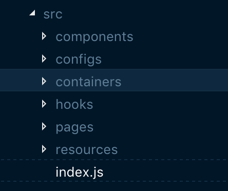

# React Hooks چی هست اصلن؟
Hooks یکی از ويژگی‌های جدیدی هست که توی React Conf حدودن دو ماه پیش معرفی شد ([لینک مشاهده کنفرانس](https://youtu.be/dpw9EHDh2bM)) و هفته‌ی پیش به صورت پایدار توی نسخه‌ی ۱۶.۸ اضافه شده. [توی مستندات](https://reactjs.org/docs/hooks-intro.html) خود ری‌اکت نوشته شده که Hooks این مسائل رو حل می‌کنه:
- استفاده مجدد از لاجیک کامپوننت‌ها سخت بود و شیوه‌هایی مثل [Render Props](https://reactjs.org/docs/render-props.html) و [Higher-Order Components](https://reactjs.org/docs/higher-order-components.html) استفاده می‌شد که مشکلاتی مثل `wrapper hell` دارن که اغلب توسعه‌دادن رو سخت‌تر می‌کنه. عکس پایین نمونه‌ای از wrapper hell هستش: (عکس متعلق به React Conf هستش)


که با Hooks می‌تونید لاجیک‌های مختلفی که می‌نویسید رو هر کدوم جداگونه تست بنویسید براش یا اکسپورت کنید و جاهای مختلف استفاده کنید.

- کامپوننت‌های بزرگ و پیچیده فهمشون سخت بود به عنوان مثال یک کامپوننت هم‌زمان ممکن بود هم توی یک سری از [lifecycle](https://reactjs.org/docs/state-and-lifecycle.html)هاش مثل `componentDidMount` و `componentDidUpdate` یک سری دیتا از سرور می‌گرفت و هم یک سری دیگه لاجیک مختص به کامپوننت کنارش نوشته می‌شد. با Hooks می‌تونید هر کدوم از این لاجیک‌ها رو به فانکشن‌های کوچک‌تر بشکونید و استفاده کنید.‍
- Class‌ها هم برای آدما سخته و هم برای کامپیوتر. استفاده از کلاس‌ها مشکلاتی رو به همراه داره به عنوان مثال اون‌ها به خوبی minify نمی‌شن و همینطور مشکلاتی رو توی `hot reloading` به وجود میارن که باعث می‌شه خیلی قابل اطمینان عمل نکنه و همونطور که [توی این پست](/frontend-interview-questions-javascript) اشاره کردم `this` توی جاوااسکریپت شرایطی داره که فهمش هم یک مقداری پیچیدس و هم دقت بیشتری رو لازم داره موقع استفاده. Hooks به شما این اجازه رو می‌ده که از همه ویژگی‌های ری‌اکت مثل `state` و `context` و ... بدون نیاز به کلاس‌ها استفاده کنید.

**خب پس از کلاس‌ها نمی‌تونیم استفاده کنیم دیگه؟ کلاس‌ها دیگه ساپورت نمی‌شه؟** شما مثل قبل می‌تونید از کلاس‌ها استفاده کنید و به این معنی نیست که شما حتمن باید از Hooks استفاده کنید. این یک ویژگی جدید ری‌اکت هستش که شما بتونید با فانکشن و بدون استفاده از کلاس‌ها کامپوننت‌هاتون رو بنویسید. مزیت‌هایی که بالاتر اشاره کردم رو هم داره ولی هر موقع احساس کردید که جایی کلاس بیشتر نیازتون رو برآورده می‌کنه از کلاس‌ها استفاده کنید. هیچ اجباری توی استفاده‌ی هر کدوم نیست. انتخاب با شماست.

# خب قراره چیکار کنیم؟

می‌خوام در غالب توسعه یک وب‌اپلیکیشن ساده از Hooks استفاده کنم و بدون نوشتن کلاس اونو انجام  بدم. [سورس‌کد پایانی پروژه رو روی گیت‌هابم قرار دادم](https://github.com/mojtabast/react-hooks-demo) که توصیه می‌کنم که clone کنید و مشاهده کنید کدهارو. چون پست بر اساس این کدها نوشته شده. [نسخه‌ی آنلاین این وب‌اپ رو هم می‌تونید از اینجا مشاهده کنید](https://react-hooks-demo-gmdduwejj.now.sh).

# چه Hookهایی رو قراره استفاده کنیم؟

توی این پست قراره از سه تا از هوک‌های پایه‌ی ری‌اکت استفاده کنیم:

### useState
این هوک برای استفاده از ویژگی State هستش که به شکل زیر نوشته می‌شه و همینطور برای اینکه تفاوت رو احساس کنید اول به شیوه‌ی قدیمی که با استفاده از کلاس بود رو هم می‌نویسم:

```jsx{41-42}

// Using class (old way)
class ClassOne extends React.Component{
  constructor(props){
    super(props);

    this.state = {
      home: 0,
      guest: 0,
    }
  }
  render(){

    return <div>
      <p>
        Home: {this.state.home}
        Guest: {this.state.guest}
      </p>
      <p>
        <button
          onClick={() =>
            this.setState({home: this.state.home + 1})
          }
        >
          Goal for home
        </button>
        <button
          onClick={ () =>
            this.setState({guest: this.state.guest + 1})
          }
        >
          Goal for guest
        </button>
      </p>
    </div>
  }
}


// Using function and hooks (new way)
function HooksOne(props) {
  var [home, setHome] = useState(0);
  var [guest, setGuest] = useState(0);

  return (
    <div>
      <p>
        Home: {home}
        Guest: {guest}
      </p>
      <p>
        <button onClick={() => setHome(home + 1)}>Goal for home</button>
        <button onClick={() => setGuest(guest + 1)}>Goal for guest</button>
      </p>
    </div>
  );
}

```

همونطور که مشاهده می‌کنید با hooks هم خیلی راحت‌تر و کوتاه‌تر همون کد رو نوشتیم و هم اینکه درگیر مسائلی مثل `this` نشدیم دیگه.

### useEffect

این هوک برای تعریف کردن سایدافکت توی کامپوننت در نظر گرفته شده. این هوک‌ در واقع سه تا از lifecycle‌ها رو شامل می‌شه: `componentDidMount`, `componentWillUnmount` و `componentDidUpdate`

برای مثال در نظر بگیرید که یک کامپوننتی هستش که می‌خواد از سرور اطلاعات بگیره. قبلن به این صورت می‌نوشتیمش:

```jsx

class ConnectedToServer extends React.Component{
  constructor(props){
    super(props);

    this.state = {

      data: []
    }
  }

  // Runs after the component output has been rendered to the DOM
  componentDidMount(){

    makeRequest("http://SomewhereIn.world").then(
       (response) => this.setState({data: response })
    );
  }

  // Runs after component is removed from DOM
  componentWillUnmount(){

    cancelRequest();
  }

  // Runs immediately after updating occurs.
  // This method is not called for the initial render.
  componentDidUpdate(){

    makeRequest("http://SomewhereIn.world").then(
       (response) => this.setState({data: response })
    );
  }

  render(){

    return <ul>
      {this.state.data.map( (item) => <li>{item}</li> )}
    </ul>
  }
}
```

و بخوایم بازنویسیش کنیم با hooks به این صورت می‌شه:

```jsx

function ConnectedToServer(props){
  var [data, handleData] = useState([]);

  useEffect(() => {

    makeRequest("http://SomewhereIn.world").then(
       (response) => this.setState({data: response })
    );

    return function cleanup(){

      cancelRequest();
    }
  });

  return <ul>
    {this.state.data.map( (item) => <li>{item}</li> )}
  </ul>
}
```

یک نکته‌ی خیلی مهمی که در مورد این هستش اینه که اگه بخواید بعد از هر آپدیتی هی هوک رو اجرا نکنه و فقط یک بار اجرا بشه باید پارامتر دوم رو ست کنید. پارامتر دوم یک آرایه هستش که بعد از هر re-render چک می‌کنه و اگه مشابه قبلی بود دیگه اجراش نمی‌کنه.

```jsx{11}
useEffect(() => {

  makeRequest("http://SomewhereIn.world").then(
    (response) => this.setState({data: response })
  );

  return function cleanup(){

    cancelRequest();
  }
}, []);
```

وقتی آرایه‌ی خالی پاس می‌دید یعنی اینکه فقط یکبار اجرا شه. حالا شما اگه بخواید فقط در صورتی که یک مقداری تغییر کرد اون هوک اجرا بشه می‌تونید به متغیر پاس بدید اونو و بعد از هر ری‌رندر ری‌اکت اون آرایه رو چک می‌کنه اگه مقادیر یکسان باشه هوک اجرا نمیشه و اگر نه که اجرا میشه. این رو در نظر بگیرید:

```jsx
useEffect(() => {

  //...
}, [name, lastname])
```

اگر `name` یا `lastname` توی ری‌رندر بعدی هنوز اگر تغییر کرده باشه هوک اجرا می‌شه.

و نکته‌ی آخر هم اینه که `useEffect` می‌تونه پاکسازی بشه که این در مواقعی مثل اینکه شما یک ریکوئستی زدید به سرور و تا جواب بیاد از سمت سرور اون کامپوننت unmount میشه یا در واقع حذف میشه از DOM، اگه از سرور پاسخ دریافت بشه چون کامپوننت حذف شده مشکلاتی از قبیل memory leak به وجود میاره. برای همین هر افکتی رو باید پاکسازی کنید در این جور مواقع. برای این کار هم کافیه که یک فانکشن return کنید. که اون فانکشن زمانی که نیاز به پاکسازی باشه ، خودکار توسط ری‌اکت صدا زده می‌شه. توی مثال بالاتر توی این فانکشن ما کنسل کردن ری‌کوئست رو قرار دادیم.

### useContext

اگه با [context](https://reactjs.org/docs/context.html) آشنا باشید می‌دونید که با `React.createContext` می‌تونید کانتکست درست کنید و بدون اینکه نیاز باشه هی با props به لایه‌های پایین‌تر پاسش بدید، تو هر سطح پایین‌تری که هست دسترسی داشته باشید بهش.
با استفاده از این هوک می‌تونید داخل فانکشن به راحتی به context دسترسی پیدا کنید. به نمونه‌ی زیر دقت کنید:

```jsx{24}

// App.js

var ThemeContext = React.createContext();

function App(props){
  var themeValues = {
    mode: "dark"
  };

  return <ThemeContext.Provider value={themeValues}>
    <Something>
      <Hello />
    </Something>
  </ThemeContext.Provider>
}

export {ThemeContext};


// Hello.js
import {ThemeContext} from "./App.js";

function Hello(){
  var theme = useContext(ThemeContext);

  return `Theme mode is: ${theme.mode}`
}
```

### قوانین هوک

- هوک‌ها رو توی بالاترین سطح صدا بزنید و استفاده کنید. یعنی توی شرط‌ها، لوپ‌ها یا فانکشن‌های تو در تو نباید استفاده کنید. ([توضیحات و دلایل کامل](https://reactjs.org/docs/hooks-rules.html#explanation))
- هوک‌ها رو توی فانکشن‌های خود ری‌اکت (کامپوننت) فقط صدا بزنید.

با رعایت کردن این قوانین شما می‌تونید بدون هیچ مشکلی از هوک‌ها استفاده کنید و همینطور تیم ری‌اکت یک پلاگین [eslint](https://www.npmjs.com/package/eslint-plugin-react-hooks) نوشته که با استفاده ازش شمارو مجبور می‌کنه که این قوانین رو رعایت کنید.

### هوک‌های بیشتر

۷ تا هوک دیگه هم وجود داره که ما چون ازش استفاده نمی‌کنیم اینجا توضیح نمی‌دم ولی می‌تونید همشون رو [توی مستندات خود ری‌اکت](https://reactjs.org/docs/hooks-reference.html) مشاهده کنید. یکی از پرکاربردترین‌هاش `useReducer` هستش که تقریبن شیوه‌ی ری‌داکس رو داره و برای State‌هایی که پیچیده‌تر هستن و مقادیر زیادی رو داخل خودشون نگه می‌دارن می‌تونید استفاده کنید.

# پیکربندی پروژه

از API [فوتبال‌دیتا](https://www.football-data.org/) استفاده کردم که برای استفاده ازش باید توکنتون رو توی `.env` ست کنید. توکن رو هم می‌تونید به رایگان از [وب‌سایتشون](https://www.football-data.org/) بگیرید.

یک توضیح مختصری از ساختار پروژه بدم. ساختار به صورت زیر هستش:


 قسمت UI رو من همیشه به سه قسمت `components`, `containers` و `pages` تقسیم می‌کنم. کامپوننت‌ها کوچک‌ترین قسمت UI هستن و هر کدوم فقط یک کار مشخص رو انجام می‌دن. کانتینرها می‌تونن شامل چندین کامپوننت داخل خودشون باشن که به هم می‌تونن مرتبط باشن، به عنوان مثال اگه یک هدر رو در نظر بگیرید، کانتینر هدر می‌تونه شامل کامپوننت‌های مشخصات، پروفایل و کاور باشه. بالاترین سطح UI رو هم پیج یا صفحه در نظر می‌گیرم که می‌تونه شامل اون دوتای دیگه باشه.
سه تا پوشه‌ی دیگه هم به نام‌های `configs`, `resources` و `hooks` وجود داره که که `configs` اغلب شامل مقادیری می‌شه که توی اپ به صورت سراسری استفاده می‌شه و نمی‌خوام هاردکد بشه توی کد. برای مثال اندپوینت‌های API و یا theme و ... . اینجا فقط اندپوینت‌های API رو داریم ما. `resources` هم فایل‌های ثابت (static) مثل تصاویر و فیلم و ... رو توش قرار می‌دم. و در نهایت `hooks` رو هم به عنوان یک پوشه‌ی جداگونه در نظر گرفتم چون hookـها رو می‌تونیم توی جاهای مختلف پروژه استفاده کنیم.

از دو تا پکیج هم استفاده کردم  توی پروژه که اولیش [Reach Router](https://github.com/reach/router) هستش که برای مدیریت کردن Routeـهاست و دیگری [React Content Loader](https://github.com/danilowoz/react-content-loader) هستش که باهاش لودینگ‌ها رو درست کردم.

# صفحه‌بندی
ما دو صفحه داریم که اولی صفحه‌ی اول اپ هستش که اسمش رو `Home` در نظر گرفتیم و دومی صفحه‌ی مشاهده‌ی اطلاعات تیم هستش که `Team` گذاشتیم اسم صفحه رو. یک `container` هم به اسم `App` در نظر می‌گیریم که در واقع یک wrapper هستش و لی‌اوت و اطلاعات موردنیاز برای شروع رو در اختیارمون قرار می‌ده.

 فایل اصلی پروژه (`index.js`) به صورت زیر می‌شه:

```jsx
import React from "react";
import ReactDOM from "react-dom";
import { Router } from "@reach/router";

import App from "./containers/App";
import Home from "./pages/Home";
import Team from "./pages/Team";

function ChampionsLeagueApp(){

  return <App>
    <Router>
      <Home path="/" />
      <Team path="/team/:id" />
    </Router>
  </App>
}

var rootElement = document.getElementById("ChampionsLeagueApp");
ReactDOM.render(<ChampionsLeagueApp />, rootElement);
```

اتفاقی که قراره بیفته اینه که ما لیست تیم‌ها رو باید توی همه‌ی صفحات داشته باشیم و همینطور توی صفحه‌ی هر تیمی که می‌ریم اطلاعات مختص به اون تیم گرفته بشه.

برای اینکه لیست تیم‌ها رو داشته باشیم توی همه‌ی صفحات باید توی کانتینر `App` لیست تیم‌ها رو بگیریم چون بالاترین سطح هستش و تمام صفحات زیرمجموعه‌ی یا در واقع بچه‌ی اون محسوب می‌شن.

پس بریم سراغش.

# گرفتن لیست تیم‌ها

همونطور که اشاره کردم لیست تیم‌ها رو باید بگیریم و توی تمام صفحات به این لیست دسترسی داشته باشن کامپوننت‌ها. برای اینکار می‌تونیم یک ساید افکت بنویسیم که از سرور لیست رو بگیره و داخل State نگهش داریم لیست رو. در نهایت هم اون رو با استفاده از Context قابل دسترس کنیم برای تمامی کامپوننت‌های سطح پایین‌تر یا به اصطلاح بچه‌ها.

پس فایل `containers/App/index.js` رو درست می‌کنیم که به شکل زیره:
(کامپوننت Nav عنوان صفحه و لینک به مقاله هستش که می‌تونید فعلن نادیده بگیریدش.)

```jsx
import React from "react";
import Nav from "../../components/Nav";
import "./styles.css";

function App(props) {

  return <div className="App">
    <Nav />
    {props.children}
  </div>
}
export default App;
```

حالا نیاز داریم که از سرور لیست تیم‌ها رو دریافت کنیم و در state نگهشون داریم. پس برای این‌کار می‌تونم از `useEffect` و `useState` استفاده کنم:

```jsx{7-47}
import React from "react";
import Nav from "../../components/Nav";
import "./styles.css";

function App(props) {

  // Defining State
  var [state, handleState] = useState({
    isLoading: true,
    data: {
      competition: {},
      season: {},
      teams: {}
    }
  });

  // Creating a side effect that update state after getting response from server.
  useEffect(() => {

    // Making a request using XMLHttpRequest
    // We can also use `fetch`, but I think request cancelation of `fetch` is a little ugly for teaching purpose.
    var xhr = new XMLHttpRequest();
    xhr.addEventListener("load", (e) => {
      // Extract requirement data from response
      var {competition, season, teams} = JSON.parse(xhr.responseText);

      // Update the state
      handleState({
        isLoading: false,
        data: {
          competition,
          season,
          teams
        }
      })
    });

    xhr.open("GET", CHAMPIONS_LEAGUE_API);
    xhr.setRequestHeader("X-Auth-Token", process.env.REACT_APP_AUTH_TOKEN);
    xhr.send();

    // In clean up function we are canceling request.
    return function cleanup(){
      xhr.abort();
    };
  // We need to pass the second argument, because we need to invoke it once.
  }, []);

  return <div className="App">
    <Nav />
    {props.children}
  </div>
}
export default App;
```

و در نهایت برای اینکه دیتایی که از سرور گرفتیم رو قابل دسترس بکنیم برای کامپوننت‌های داخل (یا همون بچه‌هاش) state رو پاس می‌دیم به context.

```jsx{2,7,12}
// ...
var AppDataContext = React.createContext();

function App(props) {
  // ...

  return <AppDataContext.Provider value={state}>
    <div className="App">
      <Nav />
      {props.children}
    </div>
  </AppDataContext.Provider>;
}

```

خب کار ما با این کانتینر تموم شد. ولی می‌تونه از این هم تمیزتر باشه کدمون. چجوری؟ می‌تونیم هوکمون رو تبدیل کنید به یک **Custom Hook** که هم کد تمیزتر می‌شه و هم به راحتی می‌تونیم اون رو توی جاهای مختلف استفاده کنیم. کاستوم هوک در واقع فقط یک فانکشن هستش که شامل هوک‌های مختلف می‌تونه باشه.

پس هوک‌های این کانتیر رو تبدیل به یک کاستوم هوک می‌کنیم و اسمش رو `useFetchCompetition` می‌ذاریم و یک فایل براش درست می‌کنیم (`hooks/useFetchCompetition.js`)که به این صورت می‌شه:

```jsx
import {useState, useEffect} from "react";
import {CHAMPIONS_LEAGUE_API} from "../configs/api";

function useFetchCompetition(){

  // Defining State
  var [state, handleState] = useState({
    isLoading: true,
    data: {
      competition: {},
      season: {},
      teams: {}
    }
  });

  // Creating a side effect that update state after getting response from server.
  useEffect(() => {

    // Making a request using XMLHttpRequest
    // We can also use `fetch`, but I think request cancelation of `fetch` is a little ugly for teaching purpose.
    var xhr = new XMLHttpRequest();
    xhr.addEventListener("load", (e) => {
      // Extract requirement data from response
      var {competition, season, teams} = JSON.parse(xhr.responseText);

      // Update the state
      handleState({
        isLoading: false,
        data: {
          competition,
          season,
          teams
        }
      })
    });

    xhr.open("GET", CHAMPIONS_LEAGUE_API);
    xhr.setRequestHeader("X-Auth-Token", process.env.REACT_APP_AUTH_TOKEN);
    xhr.send();

    // In clean up function we are canceling request.
    return function cleanup(){
      xhr.abort();
    };
  // We need to pass the second argument, because we need to invoke it once.
  }, []);

  return state;
}


export default useFetchCompetition;
```

و `containers/App.js` چی هم به این صورت:

```jsx{2,7,9}
// ...
import useFetchCompetition from "../../hooks/useFetchCompetition";
// ...

function App(props) {

  var compettion = useFetchCompetition();

  return <AppDataContext.Provider value={compettion}>
    <div className="App">
      <Nav />
      {props.children}
    </div>
  </AppDataContext.Provider>;
}
```

حالا لیست تیم ها رو توی همه‌ی صفحات داریم و می‌تونیم هر وقت خواستیم اونارو از context بگیریم. لیست تیم‌ها قراره توی صفحه‌ی اول نمایش داده بشن. بریم سراغ صفحه‌ی اصلی پس.

# صفحه اصلی

توی صفحه‌ی اصلی تنها کاری که نیاز هست اینه که با استفاده از `useContext` لیست تیم‌ها رو از context بگیریم و نمایش بدیم. توی `pages/Home.js` یک کامپوننتی داریم به اسم `TeamsList` که لیست تیم‌ها رو نمایش می‌ده. این کامپوننت رو از اینجا `components/TeamsList/index.js` باز کنید که توش به این شکل هست

```jsx{6}
// ...
import {AppDataContext} from "../../containers/App";
// ...

function TeamsList(props){
  var appData = useContext(AppDataContext);
  var teams = appData.data.teams;

  return <ul className="TeamsList">
    {
      appData.isLoading ?
      Array(10).fill(<TeamContentLoader />) :
      teams.map( team => <Team info={team} /> )
    }
  </ul>
}
```

 همونطور که می‌بینید با استفاده از هوک `useContext` از لیست تیم‌ها رو از context داریم می‌گیریم. اگر لیست در حالت لودینگ باشه که لودینگ نشون می‌ده و در غیر اینصورت تیم‌ها رو نمایش می‌ده.

# نمایش اطلاعات کامل توی صفحه‌ی هر تیم

وقتی که روی تیمی از توی لیست کلیک میشه، کاربر به صفحه‌ی تیم هدایت میشه که اونجا باید از سرور اطلاعات کامل تیم گرفته شه و بعد نمایش داده بشه.
پس توی `pages/Team.js` ما نیاز داریم که با استفاده از هوک‌ها این کارو انجام بدیم. مطابق صفحه‌ی اصلی ما نیاز داریم که یک کاستوم هوک ‌بنویسیم که توش با استفاده از `useState` و `useEffect` بتونیم از سرور اطلاعات تیم رو بگیریم.
پس یک کاستوم هوک درست می‌کنیم براش (`hooks/useFetchTeamInformation.js`) که به این صورته:

```jsx
import {useState, useEffect} from "react";
import {TEAM_API} from "../configs/api";

function useFetchTeamInformation(teamId){
  var [state, handleState] = useState({
    isLoading: true,
    data: {}
  });


  useEffect(() => {

    var xhr = new XMLHttpRequest();
    xhr.addEventListener("load", (e) => {
      var teamData = JSON.parse(xhr.responseText);

      handleState({
        isLoading: false,
        data: teamData
      })
    });

    xhr.open("GET", TEAM_API(teamId));
    xhr.setRequestHeader("X-Auth-Token", process.env.REACT_APP_AUTH_TOKEN);
    xhr.send();

    return function cleanup(){
      xhr.abort();
    };
  }, []);

  return state;
}


export default useFetchTeamInformation;
```

مشابه اون یکی کاستوم هوکمون هستش با این تفاوت که ساختار استیت و اندپوینت API فرق می‌کنه.

و حالا می‌تونیم از این کاستوم هوکی که نوشتیم استفاده کنیم توی صفحه‌ی تیم (`pages/Team.js`):

```jsx{7}
// ...
var TeamInfoContext = React.createContext();

function Team(props) {

  // Getting team id from route
  var teamId = props.id;
  var team = useFetchTeamInformation(teamId);

  return <TeamInfoContext.Provider value={team}>
    <Card header={<Back />}>

      <TeamInfo teamId={teamId} />

    </Card>
  </TeamInfoContext.Provider>;
}

// ..
```

مشابه چیزی که توی کانتینر `App` داشتیم اینجا هم کاستوم هوکمون رو صدا می‌زنیم و دیتا رو با استفاده از context پاس می‌دیم به سطوح پایین‌تر.

اینجا هم یک کامپوننتی به اسم `TeamInfo` داریم که اطلاعات تیم رو از context میگیره و نمایش می‌ده.

کامپوننت `TeamInfo` (`components/TeamInfo/index.js`) با استفاده از `useContext` اطلاعات موردنیاز رو می‌گیره از context.

```jsx{3,4}
// ...
function TeamInfo(props){
  var appData = useContext(AppDataContext);
  var teamInfo = useContext(TeamInfoContext);
  var teamOverview = !appData.isLoading &&
    appData.data.teams.find(
      team => team.id == props.teamId
    );

  // ...
}

// ..
```

اینجا اطلاعاتمون رو از دو تا context داریم می‌گیریم. اولی اطلاعات کلی تیم توشه مثل اسم و سال تاسیس و ... و دومی اطلاعات کامل شامل بازیکنان و ... توشه.  اگه از صفحه‌ی اصلی روی تیمی کلیک کنید می‌بینید که بلافاصله اطلاعات کلی تیم توی ردیف اول نمایش داده می‌شه (چون از `AppDataContext` داره می‌گیره) ولی مابقی اطلاعات رو یکم بیشتر طول می‌کشه تا بگیره چون اول از سرور اطلاعات رو باید بگیره و بعد از context قابل دسترسه.

# جمع‌بندی

همونطور که می‌بینید Hooks یکی از ویژگی‌های جذاب این روزهای ری‌اکت شده که مسلمن در آینده استفاده ازش هم بیشتر و بیشتر میشه. احتمالن یک سری سوالات توی ذهنتون شکل گرفته و یکمی ممکنه گیج کننده باشه چون یک سری از تکنیک‌ها و پکیج‌هایی که استفاده می‌شد الان ممکنه دیگه نیاز نباشن به اون صورت. سعی می‌کنم یک سری سوالاتی که برای خودم پیش اومد رو کوتاه پاسخ بدم:

- **با اومدن Hooks دیگه از کلاس‌ها پشتیبانی نمی‌شه؟**: کلاس‌ها همچنان مثل گذشته قابل استفاده هستن و هیچ مشکلی از این بابت نیست.
- **آیا نیاز هستش که از ری‌داکس استفاده کنیم؟**: بستگی داره به نیازتون داره. خیلی از آدما از ریداکس فقط برای این که state رو بدون نیاز به این که هی پاسش بدن به سطوح پایین‌تر استفاده می‌کردن. یعنی در واقع همون کاری که با context میشه انجام داد. به نظرم Hooks خیلی راحت‌تر این نیازو بر آورده می‌کنه اما من همچنان معتقدم که ری‌داکس برای پروژه‌های پیچیده‌تر نیاز هستش و از Hooks به عنوان local state استفاده می‌شه کرد و از ری‌داکس برای Application State یا Shared State. توی ری‌داکس یک store وجود داره که کل state رو میشه اونجا نگه داشت و این کمک می‌کنه خیلی راحت‌تر آدم مدیریت بکنه state رو و همینطور middlewareها و بهینه‌سازی‌های داخلی ری‌داکس برای ری‌رندرها از نکات مثبتی هستش که به نظرم چیزی هستش که همچنان بهش نیاز داشته باشیم. توی ریپازیتوری خود ری‌داکس هم مباحث مربوط به Hooks هنوز در جریانه و دارن تلاش می‌کنن به خوبی از hooks استفاده کنن.
- **با ری‌داکس شروع کنیم یا بدون ری‌داکس؟**: بدون ری‌داکس شروع کنید هر جا احساس کردید Hooks نیازتون رو برآورده نمی‌کنه از ری‌داکس استفاده کنید.
- **Render Props و یا Higher Order Component ها دیگه نیازی نداریم بهشون؟**: نمیشه گفت از بین رفتن ولی هر روشی که نیازتون رو بهتر پوشش می‌ده از همون استفاده کنید. توصیه می‌کنم [این مطلب رو از Kent C. Dodds](https://blog.kentcdodds.com/react-hooks-whats-going-to-happen-to-render-props-8ade1f00f159) بخونید.

و در پایان اگه علاقه‌مندید بدونید که چرا ترتیب صدازدن توی هوک‌ها مهمه توصیه می‌کنم که [این مطلب از Dan Abramov رو بخونید](https://overreacted.io/why-do-hooks-rely-on-call-order/).

---

خوشحال می‌شم که نظرتون رو در مورد مطالبی که می‌نویسم بدونم و این بهم کمک می‌کنه که توی مطالب بعدی در نظرشون بگیرم و بهبود بدم چیزایی که درموردشون می‌نویسم رو. ممنون که خوندید این پست رو.
